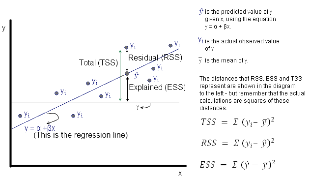
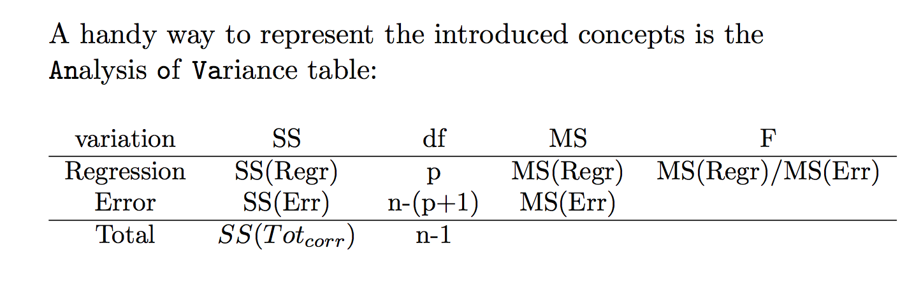

## How good is your model?

A good way to see how good your model is to measure how much of the variance of the data that is explained in your model.

There a three kinda ways to calculate this.

By looking at the picture below we can see Total sum of squares, residuals SS and Explained SS

The $TSS = Var(Y) = \sum (y_i-\bar{y})^2$

The $RSS = \sum(y_i-\hat{y})^2$

The $ESS = \sum(\hat{y}-\bar{y})^2= \sum(e_i)^2$

$\hat{y}$ is the regression line or the estimated Y.

$\bar{y}$ is the mean y

And we can see from the picture that the TSS = ESS+RSS. And also here is where the measurement $R^2 = 1-\frac{ESS}{TSS} = 1 - \frac{\sum(\hat{y}-\bar{y})^2}{\sum (y_i-\bar{y})^2} = \frac{RSS}{TSS} = \frac{\sum(y_i-\hat{y})^2}{\sum (y_i-\bar{y})^2}$

[pic](img/pvalue.png)

Explained
