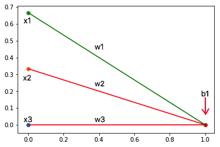

Put in the latex code for the thing you have written on your paper.

## How do neural networks work?
If we start by looking a the simplest examples of a ANN: inputs with no hidden layer and no activation function (fully connected layer)

We get:

\\[ \begin{equation*}
\begin{bmatrix}
x_{1} \\
x_{2} \\
x_{3}
\end{bmatrix}\begin{bmatrix}
\w_{1}& \w_{2}&\w_{3}
\end{bmatrix}=
x_{1}\w_{1}+x_{2}\w_{2}+x_{3}\w_{3}
\end{equation*} \\]

So here we see that we get the same equation as a multivariable linear regression.

## Activation functions.
<table class="wikitable sortable jquery-tablesorter">
<thead><tr>
<th class="headerSort" tabindex="0" role="columnheader button" title="Sort ascending">Name</th>
<th class="headerSort" tabindex="0" role="columnheader button" title="Sort ascending">Plot</th>
<th class="headerSort" tabindex="0" role="columnheader button" title="Sort ascending">Equation</th>
<th class="headerSort" tabindex="0" role="columnheader button" title="Sort ascending"><a href="/wiki/Derivative" title="Derivative">Derivative</a> (with respect to <i>x</i>)</th>
<th class="headerSort" tabindex="0" role="columnheader button" title="Sort ascending"><a href="/wiki/Interval_(mathematics)#Notations_for_intervals" title="Interval (mathematics)">Range</a></th>
<th class="headerSort" tabindex="0" role="columnheader button" title="Sort ascending"><a href="/wiki/Smoothness#Order_of_continuity" title="Smoothness">Order of continuity</a></th>
<th class="headerSort" tabindex="0" role="columnheader button" title="Sort ascending"><a href="/wiki/Monotonic_function" title="Monotonic function">Monotonic</a></th>
<th class="headerSort" tabindex="0" role="columnheader button" title="Sort ascending">Derivative Monotonic</th>
<th class="headerSort" tabindex="0" role="columnheader button" title="Sort ascending">Approximates identity near the origin</th>
</tr></thead><tbody>
<tr>
<td><a href="/wiki/Identity_function" title="Identity function">Identity</a></td>
<td></td>
<td><math xmlns="http://www.w3.org/1998/Math/MathML">
  <semantics>
    <mrow class="MJX-TeXAtom-ORD">
      <mstyle displaystyle="true" scriptlevel="0">
        <mi>f</mi>
        <mo stretchy="false">(</mo>
        <mi>x</mi>
        <mo stretchy="false">)</mo>
        <mo>=</mo>
        <mi>x</mi>
      </mstyle>
    </mrow>
    <annotation encoding="application/x-tex">{\displaystyle f(x)=x}</annotation>
  </semantics>
</math></td>
<td><math xmlns="http://www.w3.org/1998/Math/MathML">
  <semantics>
    <mrow class="MJX-TeXAtom-ORD">
      <mstyle displaystyle="true" scriptlevel="0">
        <msup>
          <mi>f</mi>
          <mo>′</mo>
        </msup>
        <mo stretchy="false">(</mo>
        <mi>x</mi>
        <mo stretchy="false">)</mo>
        <mo>=</mo>
        <mn>1</mn>
      </mstyle>
    </mrow>
    <annotation encoding="application/x-tex">{\displaystyle f'(x)=1}</annotation>
  </semantics>
</math></td>
<td><math xmlns="http://www.w3.org/1998/Math/MathML">
  <semantics>
    <mrow class="MJX-TeXAtom-ORD">
      <mstyle displaystyle="true" scriptlevel="0">
        <mo stretchy="false">(</mo>
        <mo>−<!-- − --></mo>
        <mi mathvariant="normal">∞<!-- ∞ --></mi>
        <mo>,</mo>
        <mi mathvariant="normal">∞<!-- ∞ --></mi>
        <mo stretchy="false">)</mo>
      </mstyle>
    </mrow>
    <annotation encoding="application/x-tex">{\displaystyle (-\infty ,\infty )}</annotation>
  </semantics>
</math></td>
<td><math xmlns="http://www.w3.org/1998/Math/MathML">
  <semantics>
    <mrow class="MJX-TeXAtom-ORD">
      <mstyle displaystyle="true" scriptlevel="0">
        <msup>
          <mi>C</mi>
          <mrow class="MJX-TeXAtom-ORD">
            <mi mathvariant="normal">∞<!-- ∞ --></mi>
          </mrow>
        </msup>
      </mstyle>
    </mrow>
    <annotation encoding="application/x-tex">{\displaystyle C^{\infty }}</annotation>
  </semantics>
</math></td>
<td style="background:#9F9;vertical-align:middle;text-align:center;" class="table-yes">Yes</td>
<td style="background:#9F9;vertical-align:middle;text-align:center;" class="table-yes">Yes</td>
<td style="background:#9F9;vertical-align:middle;text-align:center;" class="table-yes">Yes</td>
</tr>
<tr>
<td><a href="/wiki/Heaviside_step_function" title="Heaviside step function">Binary step</a></td>
<td></td>
<td><math xmlns="http://www.w3.org/1998/Math/MathML">
  <semantics>
    <mrow class="MJX-TeXAtom-ORD">
      <mstyle displaystyle="true" scriptlevel="0">
        <mi>f</mi>
        <mo stretchy="false">(</mo>
        <mi>x</mi>
        <mo stretchy="false">)</mo>
        <mo>=</mo>
        <mrow>
          <mo>{</mo>
          <mrow class="MJX-TeXAtom-ORD">
            <mtable columnalign="right center left" rowspacing="4pt" columnspacing="1em">
              <mtr>
                <mtd>
                  <mn>0</mn>
                </mtd>
                <mtd>
                  <mrow class="MJX-TeXAtom-ORD">
                    <mtext>for</mtext>
                  </mrow>
                </mtd>
                <mtd>
                  <mi>x</mi>
                  <mo>&lt;</mo>
                  <mn>0</mn>
                </mtd>
              </mtr>
              <mtr>
                <mtd>
                  <mn>1</mn>
                </mtd>
                <mtd>
                  <mrow class="MJX-TeXAtom-ORD">
                    <mtext>for</mtext>
                  </mrow>
                </mtd>
                <mtd>
                  <mi>x</mi>
                  <mo>≥<!-- ≥ --></mo>
                  <mn>0</mn>
                </mtd>
              </mtr>
            </mtable>
          </mrow>
          <mo fence="true" stretchy="true"></mo>
        </mrow>
      </mstyle>
    </mrow>
    <annotation encoding="application/x-tex">{\displaystyle f(x)=\left\{{\begin{array}{rcl}0&amp;{\mbox{for}}&amp;x&lt;0\\1&amp;{\mbox{for}}&amp;x\geq 0\end{array}}\right.}</annotation>
  </semantics>
</math></td>
<td><math xmlns="http://www.w3.org/1998/Math/MathML">
  <semantics>
    <mrow class="MJX-TeXAtom-ORD">
      <mstyle displaystyle="true" scriptlevel="0">
        <msup>
          <mi>f</mi>
          <mo>′</mo>
        </msup>
        <mo stretchy="false">(</mo>
        <mi>x</mi>
        <mo stretchy="false">)</mo>
        <mo>=</mo>
        <mrow>
          <mo>{</mo>
          <mrow class="MJX-TeXAtom-ORD">
            <mtable columnalign="right center left" rowspacing="4pt" columnspacing="1em">
              <mtr>
                <mtd>
                  <mn>0</mn>
                </mtd>
                <mtd>
                  <mrow class="MJX-TeXAtom-ORD">
                    <mtext>for</mtext>
                  </mrow>
                </mtd>
                <mtd>
                  <mi>x</mi>
                  <mo>≠<!-- ≠ --></mo>
                  <mn>0</mn>
                </mtd>
              </mtr>
              <mtr>
                <mtd>
                  <mo>?</mo>
                </mtd>
                <mtd>
                  <mrow class="MJX-TeXAtom-ORD">
                    <mtext>for</mtext>
                  </mrow>
                </mtd>
                <mtd>
                  <mi>x</mi>
                  <mo>=</mo>
                  <mn>0</mn>
                </mtd>
              </mtr>
            </mtable>
          </mrow>
          <mo fence="true" stretchy="true"></mo>
        </mrow>
      </mstyle>
    </mrow>
    <annotation encoding="application/x-tex">{\displaystyle f'(x)=\left\{{\begin{array}{rcl}0&amp;{\mbox{for}}&amp;x\neq 0\\?&amp;{\mbox{for}}&amp;x=0\end{array}}\right.}</annotation>
  </semantics>
</math></td>
<td><math xmlns="http://www.w3.org/1998/Math/MathML">
  <semantics>
    <mrow class="MJX-TeXAtom-ORD">
      <mstyle displaystyle="true" scriptlevel="0">
        <mo fence="false" stretchy="false">{</mo>
        <mn>0</mn>
        <mo>,</mo>
        <mn>1</mn>
        <mo fence="false" stretchy="false">}</mo>
      </mstyle>
    </mrow>
    <annotation encoding="application/x-tex">{\displaystyle \{0,1\}}</annotation>
  </semantics>
</math></td>
<td><math xmlns="http://www.w3.org/1998/Math/MathML">
  <semantics>
    <mrow class="MJX-TeXAtom-ORD">
      <mstyle displaystyle="true" scriptlevel="0">
        <msup>
          <mi>C</mi>
          <mrow class="MJX-TeXAtom-ORD">
            <mo>−<!-- − --></mo>
            <mn>1</mn>
          </mrow>
        </msup>
      </mstyle>
    </mrow>
    <annotation encoding="application/x-tex">{\displaystyle C^{-1}}</annotation>
  </semantics>
</math></td>
<td style="background:#9F9;vertical-align:middle;text-align:center;" class="table-yes">Yes</td>
<td style="background:#F99;vertical-align:middle;text-align:center;" class="table-no">No</td>
<td style="background:#F99;vertical-align:middle;text-align:center;" class="table-no">No</td>
</tr>
<tr>
<td><a href="/wiki/Logistic_function" title="Logistic function">Logistic</a> (a.k.a. Soft step)</td>
<td></td>
<td><math xmlns="http://www.w3.org/1998/Math/MathML">
  <semantics>
    <mrow class="MJX-TeXAtom-ORD">
      <mstyle displaystyle="true" scriptlevel="0">
        <mi>f</mi>
        <mo stretchy="false">(</mo>
        <mi>x</mi>
        <mo stretchy="false">)</mo>
        <mo>=</mo>
        <mrow class="MJX-TeXAtom-ORD">
          <mfrac>
            <mn>1</mn>
            <mrow>
              <mn>1</mn>
              <mo>+</mo>
              <msup>
                <mi>e</mi>
                <mrow class="MJX-TeXAtom-ORD">
                  <mo>−<!-- − --></mo>
                  <mi>x</mi>
                </mrow>
              </msup>
            </mrow>
          </mfrac>
        </mrow>
      </mstyle>
    </mrow>
    <annotation encoding="application/x-tex">{\displaystyle f(x)={\frac {1}{1+e^{-x}}}}</annotation>
  </semantics>
</math></td>
<td><math xmlns="http://www.w3.org/1998/Math/MathML">
  <semantics>
    <mrow class="MJX-TeXAtom-ORD">
      <mstyle displaystyle="true" scriptlevel="0">
        <msup>
          <mi>f</mi>
          <mo>′</mo>
        </msup>
        <mo stretchy="false">(</mo>
        <mi>x</mi>
        <mo stretchy="false">)</mo>
        <mo>=</mo>
        <mi>f</mi>
        <mo stretchy="false">(</mo>
        <mi>x</mi>
        <mo stretchy="false">)</mo>
        <mo stretchy="false">(</mo>
        <mn>1</mn>
        <mo>−<!-- − --></mo>
        <mi>f</mi>
        <mo stretchy="false">(</mo>
        <mi>x</mi>
        <mo stretchy="false">)</mo>
        <mo stretchy="false">)</mo>
      </mstyle>
    </mrow>
    <annotation encoding="application/x-tex">{\displaystyle f'(x)=f(x)(1-f(x))}</annotation>
  </semantics>
</math></td>
<td><math xmlns="http://www.w3.org/1998/Math/MathML">
  <semantics>
    <mrow class="MJX-TeXAtom-ORD">
      <mstyle displaystyle="true" scriptlevel="0">
        <mo stretchy="false">(</mo>
        <mn>0</mn>
        <mo>,</mo>
        <mn>1</mn>
        <mo stretchy="false">)</mo>
      </mstyle>
    </mrow>
    <annotation encoding="application/x-tex">{\displaystyle (0,1)}</annotation>
  </semantics>
</math></td>
<td><math xmlns="http://www.w3.org/1998/Math/MathML">
  <semantics>
    <mrow class="MJX-TeXAtom-ORD">
      <mstyle displaystyle="true" scriptlevel="0">
        <msup>
          <mi>C</mi>
          <mrow class="MJX-TeXAtom-ORD">
            <mi mathvariant="normal">∞<!-- ∞ --></mi>
          </mrow>
        </msup>
      </mstyle>
    </mrow>
    <annotation encoding="application/x-tex">{\displaystyle C^{\infty }}</annotation>
  </semantics>
</math></td>
<td style="background:#9F9;vertical-align:middle;text-align:center;" class="table-yes">Yes</td>
<td style="background:#F99;vertical-align:middle;text-align:center;" class="table-no">No</td>
<td style="background:#F99;vertical-align:middle;text-align:center;" class="table-no">No</td>
</tr>
<tr>
<td><a href="/wiki/Hyperbolic_function#Hyperbolic_tangent" title="Hyperbolic function">TanH</a></td>
<td></td>
<td><math xmlns="http://www.w3.org/1998/Math/MathML">
  <semantics>
    <mrow class="MJX-TeXAtom-ORD">
      <mstyle displaystyle="true" scriptlevel="0">
        <mi>f</mi>
        <mo stretchy="false">(</mo>
        <mi>x</mi>
        <mo stretchy="false">)</mo>
        <mo>=</mo>
        <mi>tanh</mi>
        <mo>⁡<!-- ⁡ --></mo>
        <mo stretchy="false">(</mo>
        <mi>x</mi>
        <mo stretchy="false">)</mo>
        <mo>=</mo>
        <mrow class="MJX-TeXAtom-ORD">
          <mfrac>
            <mn>2</mn>
            <mrow>
              <mn>1</mn>
              <mo>+</mo>
              <msup>
                <mi>e</mi>
                <mrow class="MJX-TeXAtom-ORD">
                  <mo>−<!-- − --></mo>
                  <mn>2</mn>
                  <mi>x</mi>
                </mrow>
              </msup>
            </mrow>
          </mfrac>
        </mrow>
        <mo>−<!-- − --></mo>
        <mn>1</mn>
      </mstyle>
    </mrow>
    <annotation encoding="application/x-tex">{\displaystyle f(x)=\tanh(x)={\frac {2}{1+e^{-2x}}}-1}</annotation>
  </semantics>
</math></td>
<td><math xmlns="http://www.w3.org/1998/Math/MathML">
  <semantics>
    <mrow class="MJX-TeXAtom-ORD">
      <mstyle displaystyle="true" scriptlevel="0">
        <msup>
          <mi>f</mi>
          <mo>′</mo>
        </msup>
        <mo stretchy="false">(</mo>
        <mi>x</mi>
        <mo stretchy="false">)</mo>
        <mo>=</mo>
        <mn>1</mn>
        <mo>−<!-- − --></mo>
        <mi>f</mi>
        <mo stretchy="false">(</mo>
        <mi>x</mi>
        <msup>
          <mo stretchy="false">)</mo>
          <mrow class="MJX-TeXAtom-ORD">
            <mn>2</mn>
          </mrow>
        </msup>
      </mstyle>
    </mrow>
    <annotation encoding="application/x-tex">{\displaystyle f'(x)=1-f(x)^{2}}</annotation>
  </semantics>
</math></td>
<td><math xmlns="http://www.w3.org/1998/Math/MathML">
  <semantics>
    <mrow class="MJX-TeXAtom-ORD">
      <mstyle displaystyle="true" scriptlevel="0">
        <mo stretchy="false">(</mo>
        <mo>−<!-- − --></mo>
        <mn>1</mn>
        <mo>,</mo>
        <mn>1</mn>
        <mo stretchy="false">)</mo>
      </mstyle>
    </mrow>
    <annotation encoding="application/x-tex">{\displaystyle (-1,1)}</annotation>
  </semantics>
</math></td>
<td><math xmlns="http://www.w3.org/1998/Math/MathML">
  <semantics>
    <mrow class="MJX-TeXAtom-ORD">
      <mstyle displaystyle="true" scriptlevel="0">
        <msup>
          <mi>C</mi>
          <mrow class="MJX-TeXAtom-ORD">
            <mi mathvariant="normal">∞<!-- ∞ --></mi>
          </mrow>
        </msup>
      </mstyle>
    </mrow>
    <annotation encoding="application/x-tex">{\displaystyle C^{\infty }}</annotation>
  </semantics>
</math></td>
<td style="background:#9F9;vertical-align:middle;text-align:center;" class="table-yes">Yes</td>
<td style="background:#F99;vertical-align:middle;text-align:center;" class="table-no">No</td>
<td style="background:#9F9;vertical-align:middle;text-align:center;" class="table-yes">Yes</td>
</tr>
<tr>
<td><a href="/wiki/Inverse_trigonometric_functions" title="Inverse trigonometric functions">ArcTan</a></td>
<td></td>
<td><math xmlns="http://www.w3.org/1998/Math/MathML">
  <semantics>
    <mrow class="MJX-TeXAtom-ORD">
      <mstyle displaystyle="true" scriptlevel="0">
        <mi>f</mi>
        <mo stretchy="false">(</mo>
        <mi>x</mi>
        <mo stretchy="false">)</mo>
        <mo>=</mo>
        <msup>
          <mi>tan</mi>
          <mrow class="MJX-TeXAtom-ORD">
            <mo>−<!-- − --></mo>
            <mn>1</mn>
          </mrow>
        </msup>
        <mo>⁡<!-- ⁡ --></mo>
        <mo stretchy="false">(</mo>
        <mi>x</mi>
        <mo stretchy="false">)</mo>
      </mstyle>
    </mrow>
    <annotation encoding="application/x-tex">{\displaystyle f(x)=\tan ^{-1}(x)}</annotation>
  </semantics>
</math></td>
<td><math xmlns="http://www.w3.org/1998/Math/MathML">
  <semantics>
    <mrow class="MJX-TeXAtom-ORD">
      <mstyle displaystyle="true" scriptlevel="0">
        <msup>
          <mi>f</mi>
          <mo>′</mo>
        </msup>
        <mo stretchy="false">(</mo>
        <mi>x</mi>
        <mo stretchy="false">)</mo>
        <mo>=</mo>
        <mrow class="MJX-TeXAtom-ORD">
          <mfrac>
            <mn>1</mn>
            <mrow>
              <msup>
                <mi>x</mi>
                <mrow class="MJX-TeXAtom-ORD">
                  <mn>2</mn>
                </mrow>
              </msup>
              <mo>+</mo>
              <mn>1</mn>
            </mrow>
          </mfrac>
        </mrow>
      </mstyle>
    </mrow>
    <annotation encoding="application/x-tex">{\displaystyle f'(x)={\frac {1}{x^{2}+1}}}</annotation>
  </semantics>
</math></td>
<td><math xmlns="http://www.w3.org/1998/Math/MathML">
  <semantics>
    <mrow class="MJX-TeXAtom-ORD">
      <mstyle displaystyle="true" scriptlevel="0">
        <mrow>
          <mo>(</mo>
          <mo>−<!-- − --></mo>
          <mrow class="MJX-TeXAtom-ORD">
            <mfrac>
              <mi>π<!-- π --></mi>
              <mn>2</mn>
            </mfrac>
          </mrow>
          <mo>,</mo>
          <mrow class="MJX-TeXAtom-ORD">
            <mfrac>
              <mi>π<!-- π --></mi>
              <mn>2</mn>
            </mfrac>
          </mrow>
          <mo>)</mo>
        </mrow>
      </mstyle>
    </mrow>
    <annotation encoding="application/x-tex">{\displaystyle \left(-{\frac {\pi }{2}},{\frac {\pi }{2}}\right)}</annotation>
  </semantics>
</math></td>
<td><math xmlns="http://www.w3.org/1998/Math/MathML">
  <semantics>
    <mrow class="MJX-TeXAtom-ORD">
      <mstyle displaystyle="true" scriptlevel="0">
        <msup>
          <mi>C</mi>
          <mrow class="MJX-TeXAtom-ORD">
            <mi mathvariant="normal">∞<!-- ∞ --></mi>
          </mrow>
        </msup>
      </mstyle>
    </mrow>
    <annotation encoding="application/x-tex">{\displaystyle C^{\infty }}</annotation>
  </semantics>
</math></td>
<td style="background:#9F9;vertical-align:middle;text-align:center;" class="table-yes">Yes</td>
<td style="background:#F99;vertical-align:middle;text-align:center;" class="table-no">No</td>
<td style="background:#9F9;vertical-align:middle;text-align:center;" class="table-yes">Yes</td>
</tr>
<tr>
<td>Softsign <a href="#cite_note-7">[7]</a><a href="#cite_note-8">[8]</a></td>
<td></td>
<td><math xmlns="http://www.w3.org/1998/Math/MathML">
  <semantics>
    <mrow class="MJX-TeXAtom-ORD">
      <mstyle displaystyle="true" scriptlevel="0">
        <mi>f</mi>
        <mo stretchy="false">(</mo>
        <mi>x</mi>
        <mo stretchy="false">)</mo>
        <mo>=</mo>
        <mrow class="MJX-TeXAtom-ORD">
          <mfrac>
            <mi>x</mi>
            <mrow>
              <mn>1</mn>
              <mo>+</mo>
              <mrow class="MJX-TeXAtom-ORD">
                <mo stretchy="false">|</mo>
              </mrow>
              <mi>x</mi>
              <mrow class="MJX-TeXAtom-ORD">
                <mo stretchy="false">|</mo>
              </mrow>
            </mrow>
          </mfrac>
        </mrow>
      </mstyle>
    </mrow>
    <annotation encoding="application/x-tex">{\displaystyle f(x)={\frac {x}{1+|x|}}}</annotation>
  </semantics>
</math></td>
<td><math xmlns="http://www.w3.org/1998/Math/MathML">
  <semantics>
    <mrow class="MJX-TeXAtom-ORD">
      <mstyle displaystyle="true" scriptlevel="0">
        <msup>
          <mi>f</mi>
          <mo>′</mo>
        </msup>
        <mo stretchy="false">(</mo>
        <mi>x</mi>
        <mo stretchy="false">)</mo>
        <mo>=</mo>
        <mrow class="MJX-TeXAtom-ORD">
          <mfrac>
            <mn>1</mn>
            <mrow>
              <mo stretchy="false">(</mo>
              <mn>1</mn>
              <mo>+</mo>
              <mrow class="MJX-TeXAtom-ORD">
                <mo stretchy="false">|</mo>
              </mrow>
              <mi>x</mi>
              <mrow class="MJX-TeXAtom-ORD">
                <mo stretchy="false">|</mo>
              </mrow>
              <msup>
                <mo stretchy="false">)</mo>
                <mrow class="MJX-TeXAtom-ORD">
                  <mn>2</mn>
                </mrow>
              </msup>
            </mrow>
          </mfrac>
        </mrow>
      </mstyle>
    </mrow>
    <annotation encoding="application/x-tex">{\displaystyle f'(x)={\frac {1}{(1+|x|)^{2}}}}</annotation>
  </semantics>
</math></td>
<td><math xmlns="http://www.w3.org/1998/Math/MathML">
  <semantics>
    <mrow class="MJX-TeXAtom-ORD">
      <mstyle displaystyle="true" scriptlevel="0">
        <mo stretchy="false">(</mo>
        <mo>−<!-- − --></mo>
        <mn>1</mn>
        <mo>,</mo>
        <mn>1</mn>
        <mo stretchy="false">)</mo>
      </mstyle>
    </mrow>
    <annotation encoding="application/x-tex">{\displaystyle (-1,1)}</annotation>
  </semantics>
</math></td>
<td><math xmlns="http://www.w3.org/1998/Math/MathML">
  <semantics>
    <mrow class="MJX-TeXAtom-ORD">
      <mstyle displaystyle="true" scriptlevel="0">
        <msup>
          <mi>C</mi>
          <mrow class="MJX-TeXAtom-ORD">
            <mn>1</mn>
          </mrow>
        </msup>
      </mstyle>
    </mrow>
    <annotation encoding="application/x-tex">{\displaystyle C^{1}}</annotation>
  </semantics>
</math></td>
<td style="background:#9F9;vertical-align:middle;text-align:center;" class="table-yes">Yes</td>
<td style="background:#F99;vertical-align:middle;text-align:center;" class="table-no">No</td>
<td style="background:#9F9;vertical-align:middle;text-align:center;" class="table-yes">Yes</td>
</tr>
<tr>
<td><a href="/wiki/Rectifier_(neural_networks)" title="Rectifier (neural networks)">Rectified linear unit</a> (ReLU)<a href="#cite_note-9">[9]</a></td>
<td></td>
<td><math xmlns="http://www.w3.org/1998/Math/MathML">
  <semantics>
    <mrow class="MJX-TeXAtom-ORD">
      <mstyle displaystyle="true" scriptlevel="0">
        <mi>f</mi>
        <mo stretchy="false">(</mo>
        <mi>x</mi>
        <mo stretchy="false">)</mo>
        <mo>=</mo>
        <mrow>
          <mo>{</mo>
          <mrow class="MJX-TeXAtom-ORD">
            <mtable columnalign="right center left" rowspacing="4pt" columnspacing="1em">
              <mtr>
                <mtd>
                  <mn>0</mn>
                </mtd>
                <mtd>
                  <mrow class="MJX-TeXAtom-ORD">
                    <mtext>for</mtext>
                  </mrow>
                </mtd>
                <mtd>
                  <mi>x</mi>
                  <mo>&lt;</mo>
                  <mn>0</mn>
                </mtd>
              </mtr>
              <mtr>
                <mtd>
                  <mi>x</mi>
                </mtd>
                <mtd>
                  <mrow class="MJX-TeXAtom-ORD">
                    <mtext>for</mtext>
                  </mrow>
                </mtd>
                <mtd>
                  <mi>x</mi>
                  <mo>≥<!-- ≥ --></mo>
                  <mn>0</mn>
                </mtd>
              </mtr>
            </mtable>
          </mrow>
          <mo fence="true" stretchy="true"></mo>
        </mrow>
      </mstyle>
    </mrow>
    <annotation encoding="application/x-tex">{\displaystyle f(x)=\left\{{\begin{array}{rcl}0&amp;{\mbox{for}}&amp;x&lt;0\\x&amp;{\mbox{for}}&amp;x\geq 0\end{array}}\right.}</annotation>
  </semantics>
</math></td>
<td><math xmlns="http://www.w3.org/1998/Math/MathML">
  <semantics>
    <mrow class="MJX-TeXAtom-ORD">
      <mstyle displaystyle="true" scriptlevel="0">
        <msup>
          <mi>f</mi>
          <mo>′</mo>
        </msup>
        <mo stretchy="false">(</mo>
        <mi>x</mi>
        <mo stretchy="false">)</mo>
        <mo>=</mo>
        <mrow>
          <mo>{</mo>
          <mrow class="MJX-TeXAtom-ORD">
            <mtable columnalign="right center left" rowspacing="4pt" columnspacing="1em">
              <mtr>
                <mtd>
                  <mn>0</mn>
                </mtd>
                <mtd>
                  <mrow class="MJX-TeXAtom-ORD">
                    <mtext>for</mtext>
                  </mrow>
                </mtd>
                <mtd>
                  <mi>x</mi>
                  <mo>&lt;</mo>
                  <mn>0</mn>
                </mtd>
              </mtr>
              <mtr>
                <mtd>
                  <mn>1</mn>
                </mtd>
                <mtd>
                  <mrow class="MJX-TeXAtom-ORD">
                    <mtext>for</mtext>
                  </mrow>
                </mtd>
                <mtd>
                  <mi>x</mi>
                  <mo>≥<!-- ≥ --></mo>
                  <mn>0</mn>
                </mtd>
              </mtr>
            </mtable>
          </mrow>
          <mo fence="true" stretchy="true"></mo>
        </mrow>
      </mstyle>
    </mrow>
    <annotation encoding="application/x-tex">{\displaystyle f'(x)=\left\{{\begin{array}{rcl}0&amp;{\mbox{for}}&amp;x&lt;0\\1&amp;{\mbox{for}}&amp;x\geq 0\end{array}}\right.}</annotation>
  </semantics>
</math></td>
<td><math xmlns="http://www.w3.org/1998/Math/MathML">
  <semantics>
    <mrow class="MJX-TeXAtom-ORD">
      <mstyle displaystyle="true" scriptlevel="0">
        <mo stretchy="false">[</mo>
        <mn>0</mn>
        <mo>,</mo>
        <mi mathvariant="normal">∞<!-- ∞ --></mi>
        <mo stretchy="false">)</mo>
      </mstyle>
    </mrow>
    <annotation encoding="application/x-tex">{\displaystyle [0,\infty )}</annotation>
  </semantics>
</math></td>
<td><math xmlns="http://www.w3.org/1998/Math/MathML">
  <semantics>
    <mrow class="MJX-TeXAtom-ORD">
      <mstyle displaystyle="true" scriptlevel="0">
        <msup>
          <mi>C</mi>
          <mrow class="MJX-TeXAtom-ORD">
            <mn>0</mn>
          </mrow>
        </msup>
      </mstyle>
    </mrow>
    <annotation encoding="application/x-tex">{\displaystyle C^{0}}</annotation>
  </semantics>
</math></td>
<td style="background:#9F9;vertical-align:middle;text-align:center;" class="table-yes">Yes</td>
<td style="background:#9F9;vertical-align:middle;text-align:center;" class="table-yes">Yes</td>
<td style="background:#F99;vertical-align:middle;text-align:center;" class="table-no">No</td>
</tr>
<tr>
<td>Leaky rectified linear unit (Leaky ReLU)<a href="#cite_note-10">[10]</a></td>
<td></td>
<td><math xmlns="http://www.w3.org/1998/Math/MathML">
  <semantics>
    <mrow class="MJX-TeXAtom-ORD">
      <mstyle displaystyle="true" scriptlevel="0">
        <mi>f</mi>
        <mo stretchy="false">(</mo>
        <mi>x</mi>
        <mo stretchy="false">)</mo>
        <mo>=</mo>
        <mrow>
          <mo>{</mo>
          <mrow class="MJX-TeXAtom-ORD">
            <mtable columnalign="right center left" rowspacing="4pt" columnspacing="1em">
              <mtr>
                <mtd>
                  <mn>0.01</mn>
                  <mi>x</mi>
                </mtd>
                <mtd>
                  <mrow class="MJX-TeXAtom-ORD">
                    <mtext>for</mtext>
                  </mrow>
                </mtd>
                <mtd>
                  <mi>x</mi>
                  <mo>&lt;</mo>
                  <mn>0</mn>
                </mtd>
              </mtr>
              <mtr>
                <mtd>
                  <mi>x</mi>
                </mtd>
                <mtd>
                  <mrow class="MJX-TeXAtom-ORD">
                    <mtext>for</mtext>
                  </mrow>
                </mtd>
                <mtd>
                  <mi>x</mi>
                  <mo>≥<!-- ≥ --></mo>
                  <mn>0</mn>
                </mtd>
              </mtr>
            </mtable>
          </mrow>
          <mo fence="true" stretchy="true"></mo>
        </mrow>
      </mstyle>
    </mrow>
    <annotation encoding="application/x-tex">{\displaystyle f(x)=\left\{{\begin{array}{rcl}0.01x&amp;{\mbox{for}}&amp;x&lt;0\\x&amp;{\mbox{for}}&amp;x\geq 0\end{array}}\right.}</annotation>
  </semantics>
</math></td>
<td><math xmlns="http://www.w3.org/1998/Math/MathML">
  <semantics>
    <mrow class="MJX-TeXAtom-ORD">
      <mstyle displaystyle="true" scriptlevel="0">
        <msup>
          <mi>f</mi>
          <mo>′</mo>
        </msup>
        <mo stretchy="false">(</mo>
        <mi>x</mi>
        <mo stretchy="false">)</mo>
        <mo>=</mo>
        <mrow>
          <mo>{</mo>
          <mrow class="MJX-TeXAtom-ORD">
            <mtable columnalign="right center left" rowspacing="4pt" columnspacing="1em">
              <mtr>
                <mtd>
                  <mn>0.01</mn>
                </mtd>
                <mtd>
                  <mrow class="MJX-TeXAtom-ORD">
                    <mtext>for</mtext>
                  </mrow>
                </mtd>
                <mtd>
                  <mi>x</mi>
                  <mo>&lt;</mo>
                  <mn>0</mn>
                </mtd>
              </mtr>
              <mtr>
                <mtd>
                  <mn>1</mn>
                </mtd>
                <mtd>
                  <mrow class="MJX-TeXAtom-ORD">
                    <mtext>for</mtext>
                  </mrow>
                </mtd>
                <mtd>
                  <mi>x</mi>
                  <mo>≥<!-- ≥ --></mo>
                  <mn>0</mn>
                </mtd>
              </mtr>
            </mtable>
          </mrow>
          <mo fence="true" stretchy="true"></mo>
        </mrow>
      </mstyle>
    </mrow>
    <annotation encoding="application/x-tex">{\displaystyle f'(x)=\left\{{\begin{array}{rcl}0.01&amp;{\mbox{for}}&amp;x&lt;0\\1&amp;{\mbox{for}}&amp;x\geq 0\end{array}}\right.}</annotation>
  </semantics>
</math></td>
<td><math xmlns="http://www.w3.org/1998/Math/MathML">
  <semantics>
    <mrow class="MJX-TeXAtom-ORD">
      <mstyle displaystyle="true" scriptlevel="0">
        <mo stretchy="false">(</mo>
        <mo>−<!-- − --></mo>
        <mi mathvariant="normal">∞<!-- ∞ --></mi>
        <mo>,</mo>
        <mi mathvariant="normal">∞<!-- ∞ --></mi>
        <mo stretchy="false">)</mo>
      </mstyle>
    </mrow>
    <annotation encoding="application/x-tex">{\displaystyle (-\infty ,\infty )}</annotation>
  </semantics>
</math></td>
<td><math xmlns="http://www.w3.org/1998/Math/MathML">
  <semantics>
    <mrow class="MJX-TeXAtom-ORD">
      <mstyle displaystyle="true" scriptlevel="0">
        <msup>
          <mi>C</mi>
          <mrow class="MJX-TeXAtom-ORD">
            <mn>0</mn>
          </mrow>
        </msup>
      </mstyle>
    </mrow>
    <annotation encoding="application/x-tex">{\displaystyle C^{0}}</annotation>
  </semantics>
</math></td>
<td style="background:#9F9;vertical-align:middle;text-align:center;" class="table-yes">Yes</td>
<td style="background:#9F9;vertical-align:middle;text-align:center;" class="table-yes">Yes</td>
<td style="background:#F99;vertical-align:middle;text-align:center;" class="table-no">No</td>
</tr>
<tr>
<td>Parameteric rectified linear unit (PReLU)<a href="#cite_note-11">[11]</a></td>
<td></td>
<td><math xmlns="http://www.w3.org/1998/Math/MathML">
  <semantics>
    <mrow class="MJX-TeXAtom-ORD">
      <mstyle displaystyle="true" scriptlevel="0">
        <mi>f</mi>
        <mo stretchy="false">(</mo>
        <mi>α<!-- α --></mi>
        <mo>,</mo>
        <mi>x</mi>
        <mo stretchy="false">)</mo>
        <mo>=</mo>
        <mrow>
          <mo>{</mo>
          <mrow class="MJX-TeXAtom-ORD">
            <mtable columnalign="right center left" rowspacing="4pt" columnspacing="1em">
              <mtr>
                <mtd>
                  <mi>α<!-- α --></mi>
                  <mi>x</mi>
                </mtd>
                <mtd>
                  <mrow class="MJX-TeXAtom-ORD">
                    <mtext>for</mtext>
                  </mrow>
                </mtd>
                <mtd>
                  <mi>x</mi>
                  <mo>&lt;</mo>
                  <mn>0</mn>
                </mtd>
              </mtr>
              <mtr>
                <mtd>
                  <mi>x</mi>
                </mtd>
                <mtd>
                  <mrow class="MJX-TeXAtom-ORD">
                    <mtext>for</mtext>
                  </mrow>
                </mtd>
                <mtd>
                  <mi>x</mi>
                  <mo>≥<!-- ≥ --></mo>
                  <mn>0</mn>
                </mtd>
              </mtr>
            </mtable>
          </mrow>
          <mo fence="true" stretchy="true"></mo>
        </mrow>
      </mstyle>
    </mrow>
    <annotation encoding="application/x-tex">{\displaystyle f(\alpha ,x)=\left\{{\begin{array}{rcl}\alpha x&amp;{\mbox{for}}&amp;x&lt;0\\x&amp;{\mbox{for}}&amp;x\geq 0\end{array}}\right.}</annotation>
  </semantics>
</math></td>
<td><math xmlns="http://www.w3.org/1998/Math/MathML">
  <semantics>
    <mrow class="MJX-TeXAtom-ORD">
      <mstyle displaystyle="true" scriptlevel="0">
        <msup>
          <mi>f</mi>
          <mo>′</mo>
        </msup>
        <mo stretchy="false">(</mo>
        <mi>α<!-- α --></mi>
        <mo>,</mo>
        <mi>x</mi>
        <mo stretchy="false">)</mo>
        <mo>=</mo>
        <mrow>
          <mo>{</mo>
          <mrow class="MJX-TeXAtom-ORD">
            <mtable columnalign="right center left" rowspacing="4pt" columnspacing="1em">
              <mtr>
                <mtd>
                  <mi>α<!-- α --></mi>
                </mtd>
                <mtd>
                  <mrow class="MJX-TeXAtom-ORD">
                    <mtext>for</mtext>
                  </mrow>
                </mtd>
                <mtd>
                  <mi>x</mi>
                  <mo>&lt;</mo>
                  <mn>0</mn>
                </mtd>
              </mtr>
              <mtr>
                <mtd>
                  <mn>1</mn>
                </mtd>
                <mtd>
                  <mrow class="MJX-TeXAtom-ORD">
                    <mtext>for</mtext>
                  </mrow>
                </mtd>
                <mtd>
                  <mi>x</mi>
                  <mo>≥<!-- ≥ --></mo>
                  <mn>0</mn>
                </mtd>
              </mtr>
            </mtable>
          </mrow>
          <mo fence="true" stretchy="true"></mo>
        </mrow>
      </mstyle>
    </mrow>
    <annotation encoding="application/x-tex">{\displaystyle f'(\alpha ,x)=\left\{{\begin{array}{rcl}\alpha &amp;{\mbox{for}}&amp;x&lt;0\\1&amp;{\mbox{for}}&amp;x\geq 0\end{array}}\right.}</annotation>
  </semantics>
</math></td>
<td><math xmlns="http://www.w3.org/1998/Math/MathML">
  <semantics>
    <mrow class="MJX-TeXAtom-ORD">
      <mstyle displaystyle="true" scriptlevel="0">
        <mo stretchy="false">(</mo>
        <mo>−<!-- − --></mo>
        <mi mathvariant="normal">∞<!-- ∞ --></mi>
        <mo>,</mo>
        <mi mathvariant="normal">∞<!-- ∞ --></mi>
        <mo stretchy="false">)</mo>
      </mstyle>
    </mrow>
    <annotation encoding="application/x-tex">{\displaystyle (-\infty ,\infty )}</annotation>
  </semantics>
</math></td>
<td><math xmlns="http://www.w3.org/1998/Math/MathML">
  <semantics>
    <mrow class="MJX-TeXAtom-ORD">
      <mstyle displaystyle="true" scriptlevel="0">
        <msup>
          <mi>C</mi>
          <mrow class="MJX-TeXAtom-ORD">
            <mn>0</mn>
          </mrow>
        </msup>
      </mstyle>
    </mrow>
    <annotation encoding="application/x-tex">{\displaystyle C^{0}}</annotation>
  </semantics>
</math></td>
<td style="background: #FED; color: black; vertical-align: middle; text-align: center;" class="depends table-depends">Yes <a href="/wiki/If_and_only_if" title="If and only if">iff</a> <math xmlns="http://www.w3.org/1998/Math/MathML">
  <semantics>
    <mrow class="MJX-TeXAtom-ORD">
      <mstyle displaystyle="true" scriptlevel="0">
        <mi>α<!-- α --></mi>
        <mo>≥<!-- ≥ --></mo>
        <mn>0</mn>
      </mstyle>
    </mrow>
    <annotation encoding="application/x-tex">{\displaystyle \alpha \geq 0}</annotation>
  </semantics>
</math></td>
<td style="background:#9F9;vertical-align:middle;text-align:center;" class="table-yes">Yes</td>
<td style="background: #FED; color: black; vertical-align: middle; text-align: center;" class="depends table-depends">Yes <a href="/wiki/If_and_only_if" title="If and only if">iff</a> <math xmlns="http://www.w3.org/1998/Math/MathML">
  <semantics>
    <mrow class="MJX-TeXAtom-ORD">
      <mstyle displaystyle="true" scriptlevel="0">
        <mi>α<!-- α --></mi>
        <mo>=</mo>
        <mn>1</mn>
      </mstyle>
    </mrow>
    <annotation encoding="application/x-tex">{\displaystyle \alpha =1}</annotation>
  </semantics>
</math></td>
</tr>
<tr>
<td>Randomized leaky rectified linear unit (RReLU)<a href="#cite_note-12">[12]</a></td>
<td></td>
<td><math xmlns="http://www.w3.org/1998/Math/MathML">
  <semantics>
    <mrow class="MJX-TeXAtom-ORD">
      <mstyle displaystyle="true" scriptlevel="0">
        <mi>f</mi>
        <mo stretchy="false">(</mo>
        <mi>α<!-- α --></mi>
        <mo>,</mo>
        <mi>x</mi>
        <mo stretchy="false">)</mo>
        <mo>=</mo>
        <mrow>
          <mo>{</mo>
          <mrow class="MJX-TeXAtom-ORD">
            <mtable columnalign="right center left" rowspacing="4pt" columnspacing="1em">
              <mtr>
                <mtd>
                  <mi>α<!-- α --></mi>
                  <mi>x</mi>
                </mtd>
                <mtd>
                  <mrow class="MJX-TeXAtom-ORD">
                    <mtext>for</mtext>
                  </mrow>
                </mtd>
                <mtd>
                  <mi>x</mi>
                  <mo>&lt;</mo>
                  <mn>0</mn>
                </mtd>
              </mtr>
              <mtr>
                <mtd>
                  <mi>x</mi>
                </mtd>
                <mtd>
                  <mrow class="MJX-TeXAtom-ORD">
                    <mtext>for</mtext>
                  </mrow>
                </mtd>
                <mtd>
                  <mi>x</mi>
                  <mo>≥<!-- ≥ --></mo>
                  <mn>0</mn>
                </mtd>
              </mtr>
            </mtable>
          </mrow>
          <mo fence="true" stretchy="true"></mo>
        </mrow>
      </mstyle>
    </mrow>
    <annotation encoding="application/x-tex">{\displaystyle f(\alpha ,x)=\left\{{\begin{array}{rcl}\alpha x&amp;{\mbox{for}}&amp;x&lt;0\\x&amp;{\mbox{for}}&amp;x\geq 0\end{array}}\right.}</annotation>
  </semantics>
</math><a class="external autonumber" href="//en.wikipedia.org/wiki/Activation_function#endnote_alpha_random">[1]</a></td>
<td><math xmlns="http://www.w3.org/1998/Math/MathML">
  <semantics>
    <mrow class="MJX-TeXAtom-ORD">
      <mstyle displaystyle="true" scriptlevel="0">
        <msup>
          <mi>f</mi>
          <mo>′</mo>
        </msup>
        <mo stretchy="false">(</mo>
        <mi>α<!-- α --></mi>
        <mo>,</mo>
        <mi>x</mi>
        <mo stretchy="false">)</mo>
        <mo>=</mo>
        <mrow>
          <mo>{</mo>
          <mrow class="MJX-TeXAtom-ORD">
            <mtable columnalign="right center left" rowspacing="4pt" columnspacing="1em">
              <mtr>
                <mtd>
                  <mi>α<!-- α --></mi>
                </mtd>
                <mtd>
                  <mrow class="MJX-TeXAtom-ORD">
                    <mtext>for</mtext>
                  </mrow>
                </mtd>
                <mtd>
                  <mi>x</mi>
                  <mo>&lt;</mo>
                  <mn>0</mn>
                </mtd>
              </mtr>
              <mtr>
                <mtd>
                  <mn>1</mn>
                </mtd>
                <mtd>
                  <mrow class="MJX-TeXAtom-ORD">
                    <mtext>for</mtext>
                  </mrow>
                </mtd>
                <mtd>
                  <mi>x</mi>
                  <mo>≥<!-- ≥ --></mo>
                  <mn>0</mn>
                </mtd>
              </mtr>
            </mtable>
          </mrow>
          <mo fence="true" stretchy="true"></mo>
        </mrow>
      </mstyle>
    </mrow>
    <annotation encoding="application/x-tex">{\displaystyle f'(\alpha ,x)=\left\{{\begin{array}{rcl}\alpha &amp;{\mbox{for}}&amp;x&lt;0\\1&amp;{\mbox{for}}&amp;x\geq 0\end{array}}\right.}</annotation>
  </semantics>
</math></td>
<td><math xmlns="http://www.w3.org/1998/Math/MathML">
  <semantics>
    <mrow class="MJX-TeXAtom-ORD">
      <mstyle displaystyle="true" scriptlevel="0">
        <mo stretchy="false">(</mo>
        <mo>−<!-- − --></mo>
        <mi mathvariant="normal">∞<!-- ∞ --></mi>
        <mo>,</mo>
        <mi mathvariant="normal">∞<!-- ∞ --></mi>
        <mo stretchy="false">)</mo>
      </mstyle>
    </mrow>
    <annotation encoding="application/x-tex">{\displaystyle (-\infty ,\infty )}</annotation>
  </semantics>
</math></td>
<td><math xmlns="http://www.w3.org/1998/Math/MathML">
  <semantics>
    <mrow class="MJX-TeXAtom-ORD">
      <mstyle displaystyle="true" scriptlevel="0">
        <msup>
          <mi>C</mi>
          <mrow class="MJX-TeXAtom-ORD">
            <mn>0</mn>
          </mrow>
        </msup>
      </mstyle>
    </mrow>
    <annotation encoding="application/x-tex">{\displaystyle C^{0}}</annotation>
  </semantics>
</math></td>
<td style="background:#9F9;vertical-align:middle;text-align:center;" class="table-yes">Yes</td>
<td style="background:#9F9;vertical-align:middle;text-align:center;" class="table-yes">Yes</td>
<td style="background:#F99;vertical-align:middle;text-align:center;" class="table-no">No</td>
</tr>
<tr>
<td>Exponential linear unit (ELU)<a href="#cite_note-13">[13]</a></td>
<td></td>
<td><math xmlns="http://www.w3.org/1998/Math/MathML">
  <semantics>
    <mrow class="MJX-TeXAtom-ORD">
      <mstyle displaystyle="true" scriptlevel="0">
        <mi>f</mi>
        <mo stretchy="false">(</mo>
        <mi>α<!-- α --></mi>
        <mo>,</mo>
        <mi>x</mi>
        <mo stretchy="false">)</mo>
        <mo>=</mo>
        <mrow>
          <mo>{</mo>
          <mrow class="MJX-TeXAtom-ORD">
            <mtable columnalign="right center left" rowspacing="4pt" columnspacing="1em">
              <mtr>
                <mtd>
                  <mi>α<!-- α --></mi>
                  <mo stretchy="false">(</mo>
                  <msup>
                    <mi>e</mi>
                    <mrow class="MJX-TeXAtom-ORD">
                      <mi>x</mi>
                    </mrow>
                  </msup>
                  <mo>−<!-- − --></mo>
                  <mn>1</mn>
                  <mo stretchy="false">)</mo>
                </mtd>
                <mtd>
                  <mrow class="MJX-TeXAtom-ORD">
                    <mtext>for</mtext>
                  </mrow>
                </mtd>
                <mtd>
                  <mi>x</mi>
                  <mo>&lt;</mo>
                  <mn>0</mn>
                </mtd>
              </mtr>
              <mtr>
                <mtd>
                  <mi>x</mi>
                </mtd>
                <mtd>
                  <mrow class="MJX-TeXAtom-ORD">
                    <mtext>for</mtext>
                  </mrow>
                </mtd>
                <mtd>
                  <mi>x</mi>
                  <mo>≥<!-- ≥ --></mo>
                  <mn>0</mn>
                </mtd>
              </mtr>
            </mtable>
          </mrow>
          <mo fence="true" stretchy="true"></mo>
        </mrow>
      </mstyle>
    </mrow>
    <annotation encoding="application/x-tex">{\displaystyle f(\alpha ,x)=\left\{{\begin{array}{rcl}\alpha (e^{x}-1)&amp;{\mbox{for}}&amp;x&lt;0\\x&amp;{\mbox{for}}&amp;x\geq 0\end{array}}\right.}</annotation>
  </semantics>
</math></td>
<td><math xmlns="http://www.w3.org/1998/Math/MathML">
  <semantics>
    <mrow class="MJX-TeXAtom-ORD">
      <mstyle displaystyle="true" scriptlevel="0">
        <msup>
          <mi>f</mi>
          <mo>′</mo>
        </msup>
        <mo stretchy="false">(</mo>
        <mi>α<!-- α --></mi>
        <mo>,</mo>
        <mi>x</mi>
        <mo stretchy="false">)</mo>
        <mo>=</mo>
        <mrow>
          <mo>{</mo>
          <mrow class="MJX-TeXAtom-ORD">
            <mtable columnalign="right center left" rowspacing="4pt" columnspacing="1em">
              <mtr>
                <mtd>
                  <mi>f</mi>
                  <mo stretchy="false">(</mo>
                  <mi>α<!-- α --></mi>
                  <mo>,</mo>
                  <mi>x</mi>
                  <mo stretchy="false">)</mo>
                  <mo>+</mo>
                  <mi>α<!-- α --></mi>
                </mtd>
                <mtd>
                  <mrow class="MJX-TeXAtom-ORD">
                    <mtext>for</mtext>
                  </mrow>
                </mtd>
                <mtd>
                  <mi>x</mi>
                  <mo>&lt;</mo>
                  <mn>0</mn>
                </mtd>
              </mtr>
              <mtr>
                <mtd>
                  <mn>1</mn>
                </mtd>
                <mtd>
                  <mrow class="MJX-TeXAtom-ORD">
                    <mtext>for</mtext>
                  </mrow>
                </mtd>
                <mtd>
                  <mi>x</mi>
                  <mo>≥<!-- ≥ --></mo>
                  <mn>0</mn>
                </mtd>
              </mtr>
            </mtable>
          </mrow>
          <mo fence="true" stretchy="true"></mo>
        </mrow>
      </mstyle>
    </mrow>
    <annotation encoding="application/x-tex">{\displaystyle f'(\alpha ,x)=\left\{{\begin{array}{rcl}f(\alpha ,x)+\alpha &amp;{\mbox{for}}&amp;x&lt;0\\1&amp;{\mbox{for}}&amp;x\geq 0\end{array}}\right.}</annotation>
  </semantics>
</math></td>
<td><math xmlns="http://www.w3.org/1998/Math/MathML">
  <semantics>
    <mrow class="MJX-TeXAtom-ORD">
      <mstyle displaystyle="true" scriptlevel="0">
        <mo stretchy="false">(</mo>
        <mo>−<!-- − --></mo>
        <mi>α<!-- α --></mi>
        <mo>,</mo>
        <mi mathvariant="normal">∞<!-- ∞ --></mi>
        <mo stretchy="false">)</mo>
      </mstyle>
    </mrow>
    <annotation encoding="application/x-tex">{\displaystyle (-\alpha ,\infty )}</annotation>
  </semantics>
</math></td>
<td><math xmlns="http://www.w3.org/1998/Math/MathML">
  <semantics>
    <mrow class="MJX-TeXAtom-ORD">
      <mstyle displaystyle="true" scriptlevel="0">
        <msup>
          <mi>C</mi>
          <mrow class="MJX-TeXAtom-ORD">
            <mn>1</mn>
          </mrow>
        </msup>
      </mstyle>
    </mrow>
    <annotation encoding="application/x-tex">{\displaystyle C^{1}}</annotation>
  </semantics>
</math> when 
<math xmlns="http://www.w3.org/1998/Math/MathML">
  <semantics>
    <mrow class="MJX-TeXAtom-ORD">
      <mstyle displaystyle="true" scriptlevel="0">
        <mi>α<!-- α --></mi>
        <mo>=</mo>
        <mn>1</mn>
      </mstyle>
    </mrow>
    <annotation encoding="application/x-tex">{\displaystyle \alpha =1}</annotation>
  </semantics>
</math>, otherwise <math xmlns="http://www.w3.org/1998/Math/MathML">
  <semantics>
    <mrow class="MJX-TeXAtom-ORD">
      <mstyle displaystyle="true" scriptlevel="0">
        <msup>
          <mi>C</mi>
          <mrow class="MJX-TeXAtom-ORD">
            <mn>0</mn>
          </mrow>
        </msup>
      </mstyle>
    </mrow>
    <annotation encoding="application/x-tex">{\displaystyle C^{0}}</annotation>
  </semantics>
</math></td>
<td style="background: #FED; color: black; vertical-align: middle; text-align: center;" class="depends table-depends">Yes <a href="/wiki/If_and_only_if" title="If and only if">iff</a> <math xmlns="http://www.w3.org/1998/Math/MathML">
  <semantics>
    <mrow class="MJX-TeXAtom-ORD">
      <mstyle displaystyle="true" scriptlevel="0">
        <mi>α<!-- α --></mi>
        <mo>≥<!-- ≥ --></mo>
        <mn>0</mn>
      </mstyle>
    </mrow>
    <annotation encoding="application/x-tex">{\displaystyle \alpha \geq 0}</annotation>
  </semantics>
</math></td>
<td style="background: #FED; color: black; vertical-align: middle; text-align: center;" class="depends table-depends">Yes <a href="/wiki/If_and_only_if" title="If and only if">iff</a> <math xmlns="http://www.w3.org/1998/Math/MathML">
  <semantics>
    <mrow class="MJX-TeXAtom-ORD">
      <mstyle displaystyle="true" scriptlevel="0">
        <mn>0</mn>
        <mo>≤<!-- ≤ --></mo>
        <mi>α<!-- α --></mi>
        <mo>≤<!-- ≤ --></mo>
        <mn>1</mn>
      </mstyle>
    </mrow>
    <annotation encoding="application/x-tex">{\displaystyle 0\leq \alpha \leq 1}</annotation>
  </semantics>
</math></td>
<td style="background: #FED; color: black; vertical-align: middle; text-align: center;" class="depends table-depends">Yes <a href="/wiki/If_and_only_if" title="If and only if">iff</a> <math xmlns="http://www.w3.org/1998/Math/MathML">
  <semantics>
    <mrow class="MJX-TeXAtom-ORD">
      <mstyle displaystyle="true" scriptlevel="0">
        <mi>α<!-- α --></mi>
        <mo>=</mo>
        <mn>1</mn>
      </mstyle>
    </mrow>
    <annotation encoding="application/x-tex">{\displaystyle \alpha =1}</annotation>
  </semantics>
</math></td>
</tr>
<tr>
<td>Scaled exponential linear unit (SELU)<a href="#cite_note-14">[14]</a></td>
<td></td>
<td><math xmlns="http://www.w3.org/1998/Math/MathML">
  <semantics>
    <mrow class="MJX-TeXAtom-ORD">
      <mstyle displaystyle="true" scriptlevel="0">
        <mi>f</mi>
        <mo stretchy="false">(</mo>
        <mi>α<!-- α --></mi>
        <mo>,</mo>
        <mi>x</mi>
        <mo stretchy="false">)</mo>
        <mo>=</mo>
        <mi>λ<!-- λ --></mi>
        <mrow>
          <mo>{</mo>
          <mrow class="MJX-TeXAtom-ORD">
            <mtable columnalign="right center left" rowspacing="4pt" columnspacing="1em">
              <mtr>
                <mtd>
                  <mi>α<!-- α --></mi>
                  <mo stretchy="false">(</mo>
                  <msup>
                    <mi>e</mi>
                    <mrow class="MJX-TeXAtom-ORD">
                      <mi>x</mi>
                    </mrow>
                  </msup>
                  <mo>−<!-- − --></mo>
                  <mn>1</mn>
                  <mo stretchy="false">)</mo>
                </mtd>
                <mtd>
                  <mrow class="MJX-TeXAtom-ORD">
                    <mtext>for</mtext>
                  </mrow>
                </mtd>
                <mtd>
                  <mi>x</mi>
                  <mo>&lt;</mo>
                  <mn>0</mn>
                </mtd>
              </mtr>
              <mtr>
                <mtd>
                  <mi>x</mi>
                </mtd>
                <mtd>
                  <mrow class="MJX-TeXAtom-ORD">
                    <mtext>for</mtext>
                  </mrow>
                </mtd>
                <mtd>
                  <mi>x</mi>
                  <mo>≥<!-- ≥ --></mo>
                  <mn>0</mn>
                </mtd>
              </mtr>
            </mtable>
          </mrow>
          <mo fence="true" stretchy="true"></mo>
        </mrow>
      </mstyle>
    </mrow>
    <annotation encoding="application/x-tex">{\displaystyle f(\alpha ,x)=\lambda \left\{{\begin{array}{rcl}\alpha (e^{x}-1)&amp;{\mbox{for}}&amp;x&lt;0\\x&amp;{\mbox{for}}&amp;x\geq 0\end{array}}\right.}</annotation>
  </semantics>
</math>

with <math xmlns="http://www.w3.org/1998/Math/MathML">
  <semantics>
    <mrow class="MJX-TeXAtom-ORD">
      <mstyle displaystyle="true" scriptlevel="0">
        <mi>λ<!-- λ --></mi>
        <mo>=</mo>
        <mn>1.0507</mn>
      </mstyle>
    </mrow>
    <annotation encoding="application/x-tex">{\displaystyle \lambda =1.0507}</annotation>
  </semantics>
</math> and <math xmlns="http://www.w3.org/1998/Math/MathML">
  <semantics>
    <mrow class="MJX-TeXAtom-ORD">
      <mstyle displaystyle="true" scriptlevel="0">
        <mi>α<!-- α --></mi>
        <mo>=</mo>
        <mn>1.67326</mn>
      </mstyle>
    </mrow>
    <annotation encoding="application/x-tex">{\displaystyle \alpha =1.67326}</annotation>
  </semantics>
</math>

</td>
<td><math xmlns="http://www.w3.org/1998/Math/MathML">
  <semantics>
    <mrow class="MJX-TeXAtom-ORD">
      <mstyle displaystyle="true" scriptlevel="0">
        <msup>
          <mi>f</mi>
          <mo>′</mo>
        </msup>
        <mo stretchy="false">(</mo>
        <mi>α<!-- α --></mi>
        <mo>,</mo>
        <mi>x</mi>
        <mo stretchy="false">)</mo>
        <mo>=</mo>
        <mi>λ<!-- λ --></mi>
        <mrow>
          <mo>{</mo>
          <mrow class="MJX-TeXAtom-ORD">
            <mtable columnalign="right center left" rowspacing="4pt" columnspacing="1em">
              <mtr>
                <mtd>
                  <mi>f</mi>
                  <mo stretchy="false">(</mo>
                  <mi>α<!-- α --></mi>
                  <mo>,</mo>
                  <mi>x</mi>
                  <mo stretchy="false">)</mo>
                  <mo>+</mo>
                  <mi>α<!-- α --></mi>
                </mtd>
                <mtd>
                  <mrow class="MJX-TeXAtom-ORD">
                    <mtext>for</mtext>
                  </mrow>
                </mtd>
                <mtd>
                  <mi>x</mi>
                  <mo>&lt;</mo>
                  <mn>0</mn>
                </mtd>
              </mtr>
              <mtr>
                <mtd>
                  <mn>1</mn>
                </mtd>
                <mtd>
                  <mrow class="MJX-TeXAtom-ORD">
                    <mtext>for</mtext>
                  </mrow>
                </mtd>
                <mtd>
                  <mi>x</mi>
                  <mo>≥<!-- ≥ --></mo>
                  <mn>0</mn>
                </mtd>
              </mtr>
            </mtable>
          </mrow>
          <mo fence="true" stretchy="true"></mo>
        </mrow>
      </mstyle>
    </mrow>
    <annotation encoding="application/x-tex">{\displaystyle f'(\alpha ,x)=\lambda \left\{{\begin{array}{rcl}f(\alpha ,x)+\alpha &amp;{\mbox{for}}&amp;x&lt;0\\1&amp;{\mbox{for}}&amp;x\geq 0\end{array}}\right.}</annotation>
  </semantics>
</math></td>
<td><math xmlns="http://www.w3.org/1998/Math/MathML">
  <semantics>
    <mrow class="MJX-TeXAtom-ORD">
      <mstyle displaystyle="true" scriptlevel="0">
        <mo stretchy="false">(</mo>
        <mo>−<!-- − --></mo>
        <mi>λ<!-- λ --></mi>
        <mi>α<!-- α --></mi>
        <mo>,</mo>
        <mi mathvariant="normal">∞<!-- ∞ --></mi>
        <mo stretchy="false">)</mo>
      </mstyle>
    </mrow>
    <annotation encoding="application/x-tex">{\displaystyle (-\lambda \alpha ,\infty )}</annotation>
  </semantics>
</math></td>
<td><math xmlns="http://www.w3.org/1998/Math/MathML">
  <semantics>
    <mrow class="MJX-TeXAtom-ORD">
      <mstyle displaystyle="true" scriptlevel="0">
        <msup>
          <mi>C</mi>
          <mrow class="MJX-TeXAtom-ORD">
            <mn>0</mn>
          </mrow>
        </msup>
      </mstyle>
    </mrow>
    <annotation encoding="application/x-tex">{\displaystyle C^{0}}</annotation>
  </semantics>
</math></td>
<td style="background:#9F9;vertical-align:middle;text-align:center;" class="table-yes">Yes</td>
<td style="background:#F99;vertical-align:middle;text-align:center;" class="table-no">No</td>
<td style="background:#F99;vertical-align:middle;text-align:center;" class="table-no">No</td>
</tr>
<tr>
<td>S-shaped rectified linear activation unit (SReLU)<a href="#cite_note-15">[15]</a></td>
<td></td>
<td><math xmlns="http://www.w3.org/1998/Math/MathML">
  <semantics>
    <mrow class="MJX-TeXAtom-ORD">
      <mstyle displaystyle="true" scriptlevel="0">
        <msub>
          <mi>f</mi>
          <mrow class="MJX-TeXAtom-ORD">
            <msub>
              <mi>t</mi>
              <mrow class="MJX-TeXAtom-ORD">
                <mi>l</mi>
              </mrow>
            </msub>
            <mo>,</mo>
            <msub>
              <mi>a</mi>
              <mrow class="MJX-TeXAtom-ORD">
                <mi>l</mi>
              </mrow>
            </msub>
            <mo>,</mo>
            <msub>
              <mi>t</mi>
              <mrow class="MJX-TeXAtom-ORD">
                <mi>r</mi>
              </mrow>
            </msub>
            <mo>,</mo>
            <msub>
              <mi>a</mi>
              <mrow class="MJX-TeXAtom-ORD">
                <mi>r</mi>
              </mrow>
            </msub>
          </mrow>
        </msub>
        <mo stretchy="false">(</mo>
        <mi>x</mi>
        <mo stretchy="false">)</mo>
        <mo>=</mo>
        <mrow>
          <mo>{</mo>
          <mrow class="MJX-TeXAtom-ORD">
            <mtable columnalign="right center left" rowspacing="4pt" columnspacing="1em">
              <mtr>
                <mtd>
                  <msub>
                    <mi>t</mi>
                    <mrow class="MJX-TeXAtom-ORD">
                      <mi>l</mi>
                    </mrow>
                  </msub>
                  <mo>+</mo>
                  <msub>
                    <mi>a</mi>
                    <mrow class="MJX-TeXAtom-ORD">
                      <mi>l</mi>
                    </mrow>
                  </msub>
                  <mo stretchy="false">(</mo>
                  <mi>x</mi>
                  <mo>−<!-- − --></mo>
                  <msub>
                    <mi>t</mi>
                    <mrow class="MJX-TeXAtom-ORD">
                      <mi>l</mi>
                    </mrow>
                  </msub>
                  <mo stretchy="false">)</mo>
                </mtd>
                <mtd>
                  <mrow class="MJX-TeXAtom-ORD">
                    <mtext>for</mtext>
                  </mrow>
                </mtd>
                <mtd>
                  <mi>x</mi>
                  <mo>≤<!-- ≤ --></mo>
                  <msub>
                    <mi>t</mi>
                    <mrow class="MJX-TeXAtom-ORD">
                      <mi>l</mi>
                    </mrow>
                  </msub>
                </mtd>
              </mtr>
              <mtr>
                <mtd>
                  <mi>x</mi>
                </mtd>
                <mtd>
                  <mrow class="MJX-TeXAtom-ORD">
                    <mtext>for</mtext>
                  </mrow>
                </mtd>
                <mtd>
                  <msub>
                    <mi>t</mi>
                    <mrow class="MJX-TeXAtom-ORD">
                      <mi>l</mi>
                    </mrow>
                  </msub>
                  <mo>&lt;</mo>
                  <mi>x</mi>
                  <mo>&lt;</mo>
                  <msub>
                    <mi>t</mi>
                    <mrow class="MJX-TeXAtom-ORD">
                      <mi>r</mi>
                    </mrow>
                  </msub>
                </mtd>
              </mtr>
              <mtr>
                <mtd>
                  <msub>
                    <mi>t</mi>
                    <mrow class="MJX-TeXAtom-ORD">
                      <mi>r</mi>
                    </mrow>
                  </msub>
                  <mo>+</mo>
                  <msub>
                    <mi>a</mi>
                    <mrow class="MJX-TeXAtom-ORD">
                      <mi>r</mi>
                    </mrow>
                  </msub>
                  <mo stretchy="false">(</mo>
                  <mi>x</mi>
                  <mo>−<!-- − --></mo>
                  <msub>
                    <mi>t</mi>
                    <mrow class="MJX-TeXAtom-ORD">
                      <mi>r</mi>
                    </mrow>
                  </msub>
                  <mo stretchy="false">)</mo>
                </mtd>
                <mtd>
                  <mrow class="MJX-TeXAtom-ORD">
                    <mtext>for</mtext>
                  </mrow>
                </mtd>
                <mtd>
                  <mi>x</mi>
                  <mo>≥<!-- ≥ --></mo>
                  <msub>
                    <mi>t</mi>
                    <mrow class="MJX-TeXAtom-ORD">
                      <mi>r</mi>
                    </mrow>
                  </msub>
                </mtd>
              </mtr>
            </mtable>
          </mrow>
          <mo fence="true" stretchy="true"></mo>
        </mrow>
      </mstyle>
    </mrow>
    <annotation encoding="application/x-tex">{\displaystyle f_{t_{l},a_{l},t_{r},a_{r}}(x)=\left\{{\begin{array}{rcl}t_{l}+a_{l}(x-t_{l})&amp;{\mbox{for}}&amp;x\leq t_{l}\\x&amp;{\mbox{for}}&amp;t_{l}&lt;x&lt;t_{r}\\t_{r}+a_{r}(x-t_{r})&amp;{\mbox{for}}&amp;x\geq t_{r}\end{array}}\right.}</annotation>
  </semantics>
</math> 
<math xmlns="http://www.w3.org/1998/Math/MathML">
  <semantics>
    <mrow class="MJX-TeXAtom-ORD">
      <mstyle displaystyle="true" scriptlevel="0">
        <msub>
          <mi>t</mi>
          <mrow class="MJX-TeXAtom-ORD">
            <mi>l</mi>
          </mrow>
        </msub>
        <mo>,</mo>
        <msub>
          <mi>a</mi>
          <mrow class="MJX-TeXAtom-ORD">
            <mi>l</mi>
          </mrow>
        </msub>
        <mo>,</mo>
        <msub>
          <mi>t</mi>
          <mrow class="MJX-TeXAtom-ORD">
            <mi>r</mi>
          </mrow>
        </msub>
        <mo>,</mo>
        <msub>
          <mi>a</mi>
          <mrow class="MJX-TeXAtom-ORD">
            <mi>r</mi>
          </mrow>
        </msub>
      </mstyle>
    </mrow>
    <annotation encoding="application/x-tex">{\displaystyle t_{l},a_{l},t_{r},a_{r}}</annotation>
  </semantics>
</math> are parameters.</td>
<td><math xmlns="http://www.w3.org/1998/Math/MathML">
  <semantics>
    <mrow class="MJX-TeXAtom-ORD">
      <mstyle displaystyle="true" scriptlevel="0">
        <msubsup>
          <mi>f</mi>
          <mrow class="MJX-TeXAtom-ORD">
            <msub>
              <mi>t</mi>
              <mrow class="MJX-TeXAtom-ORD">
                <mi>l</mi>
              </mrow>
            </msub>
            <mo>,</mo>
            <msub>
              <mi>a</mi>
              <mrow class="MJX-TeXAtom-ORD">
                <mi>l</mi>
              </mrow>
            </msub>
            <mo>,</mo>
            <msub>
              <mi>t</mi>
              <mrow class="MJX-TeXAtom-ORD">
                <mi>r</mi>
              </mrow>
            </msub>
            <mo>,</mo>
            <msub>
              <mi>a</mi>
              <mrow class="MJX-TeXAtom-ORD">
                <mi>r</mi>
              </mrow>
            </msub>
          </mrow>
          <mo>′</mo>
        </msubsup>
        <mo stretchy="false">(</mo>
        <mi>x</mi>
        <mo stretchy="false">)</mo>
        <mo>=</mo>
        <mrow>
          <mo>{</mo>
          <mrow class="MJX-TeXAtom-ORD">
            <mtable columnalign="right center left" rowspacing="4pt" columnspacing="1em">
              <mtr>
                <mtd>
                  <msub>
                    <mi>a</mi>
                    <mrow class="MJX-TeXAtom-ORD">
                      <mi>l</mi>
                    </mrow>
                  </msub>
                </mtd>
                <mtd>
                  <mrow class="MJX-TeXAtom-ORD">
                    <mtext>for</mtext>
                  </mrow>
                </mtd>
                <mtd>
                  <mi>x</mi>
                  <mo>≤<!-- ≤ --></mo>
                  <msub>
                    <mi>t</mi>
                    <mrow class="MJX-TeXAtom-ORD">
                      <mi>l</mi>
                    </mrow>
                  </msub>
                </mtd>
              </mtr>
              <mtr>
                <mtd>
                  <mn>1</mn>
                </mtd>
                <mtd>
                  <mrow class="MJX-TeXAtom-ORD">
                    <mtext>for</mtext>
                  </mrow>
                </mtd>
                <mtd>
                  <msub>
                    <mi>t</mi>
                    <mrow class="MJX-TeXAtom-ORD">
                      <mi>l</mi>
                    </mrow>
                  </msub>
                  <mo>&lt;</mo>
                  <mi>x</mi>
                  <mo>&lt;</mo>
                  <msub>
                    <mi>t</mi>
                    <mrow class="MJX-TeXAtom-ORD">
                      <mi>r</mi>
                    </mrow>
                  </msub>
                </mtd>
              </mtr>
              <mtr>
                <mtd>
                  <msub>
                    <mi>a</mi>
                    <mrow class="MJX-TeXAtom-ORD">
                      <mi>r</mi>
                    </mrow>
                  </msub>
                </mtd>
                <mtd>
                  <mrow class="MJX-TeXAtom-ORD">
                    <mtext>for</mtext>
                  </mrow>
                </mtd>
                <mtd>
                  <mi>x</mi>
                  <mo>≥<!-- ≥ --></mo>
                  <msub>
                    <mi>t</mi>
                    <mrow class="MJX-TeXAtom-ORD">
                      <mi>r</mi>
                    </mrow>
                  </msub>
                </mtd>
              </mtr>
            </mtable>
          </mrow>
          <mo fence="true" stretchy="true"></mo>
        </mrow>
      </mstyle>
    </mrow>
    <annotation encoding="application/x-tex">{\displaystyle f'_{t_{l},a_{l},t_{r},a_{r}}(x)=\left\{{\begin{array}{rcl}a_{l}&amp;{\mbox{for}}&amp;x\leq t_{l}\\1&amp;{\mbox{for}}&amp;t_{l}&lt;x&lt;t_{r}\\a_{r}&amp;{\mbox{for}}&amp;x\geq t_{r}\end{array}}\right.}</annotation>
  </semantics>
</math></td>
<td><math xmlns="http://www.w3.org/1998/Math/MathML">
  <semantics>
    <mrow class="MJX-TeXAtom-ORD">
      <mstyle displaystyle="true" scriptlevel="0">
        <mo stretchy="false">(</mo>
        <mo>−<!-- − --></mo>
        <mi mathvariant="normal">∞<!-- ∞ --></mi>
        <mo>,</mo>
        <mi mathvariant="normal">∞<!-- ∞ --></mi>
        <mo stretchy="false">)</mo>
      </mstyle>
    </mrow>
    <annotation encoding="application/x-tex">{\displaystyle (-\infty ,\infty )}</annotation>
  </semantics>
</math></td>
<td><math xmlns="http://www.w3.org/1998/Math/MathML">
  <semantics>
    <mrow class="MJX-TeXAtom-ORD">
      <mstyle displaystyle="true" scriptlevel="0">
        <msup>
          <mi>C</mi>
          <mrow class="MJX-TeXAtom-ORD">
            <mn>0</mn>
          </mrow>
        </msup>
      </mstyle>
    </mrow>
    <annotation encoding="application/x-tex">{\displaystyle C^{0}}</annotation>
  </semantics>
</math></td>
<td style="background:#F99;vertical-align:middle;text-align:center;" class="table-no">No</td>
<td style="background:#F99;vertical-align:middle;text-align:center;" class="table-no">No</td>
<td style="background:#F99;vertical-align:middle;text-align:center;" class="table-no">No</td>
</tr>
<tr>
<td>Adaptive piecewise linear (APL) <a href="#cite_note-16">[16]</a></td>
<td></td>
<td><math xmlns="http://www.w3.org/1998/Math/MathML">
  <semantics>
    <mrow class="MJX-TeXAtom-ORD">
      <mstyle displaystyle="true" scriptlevel="0">
        <mi>f</mi>
        <mo stretchy="false">(</mo>
        <mi>x</mi>
        <mo stretchy="false">)</mo>
        <mo>=</mo>
        <mo movablelimits="true" form="prefix">max</mo>
        <mo stretchy="false">(</mo>
        <mn>0</mn>
        <mo>,</mo>
        <mi>x</mi>
        <mo stretchy="false">)</mo>
        <mo>+</mo>
        <munderover>
          <mo>∑<!-- ∑ --></mo>
          <mrow class="MJX-TeXAtom-ORD">
            <mi>s</mi>
            <mo>=</mo>
            <mn>1</mn>
          </mrow>
          <mrow class="MJX-TeXAtom-ORD">
            <mi>S</mi>
          </mrow>
        </munderover>
        <msubsup>
          <mi>a</mi>
          <mrow class="MJX-TeXAtom-ORD">
            <mi>i</mi>
          </mrow>
          <mrow class="MJX-TeXAtom-ORD">
            <mi>s</mi>
          </mrow>
        </msubsup>
        <mo movablelimits="true" form="prefix">max</mo>
        <mo stretchy="false">(</mo>
        <mn>0</mn>
        <mo>,</mo>
        <mo>−<!-- − --></mo>
        <mi>x</mi>
        <mo>+</mo>
        <msubsup>
          <mi>b</mi>
          <mrow class="MJX-TeXAtom-ORD">
            <mi>i</mi>
          </mrow>
          <mrow class="MJX-TeXAtom-ORD">
            <mi>s</mi>
          </mrow>
        </msubsup>
        <mo stretchy="false">)</mo>
      </mstyle>
    </mrow>
    <annotation encoding="application/x-tex">{\displaystyle f(x)=\max(0,x)+\sum _{s=1}^{S}a_{i}^{s}\max(0,-x+b_{i}^{s})}</annotation>
  </semantics>
</math></td>
<td><math xmlns="http://www.w3.org/1998/Math/MathML">
  <semantics>
    <mrow class="MJX-TeXAtom-ORD">
      <mstyle displaystyle="true" scriptlevel="0">
        <msup>
          <mi>f</mi>
          <mo>′</mo>
        </msup>
        <mo stretchy="false">(</mo>
        <mi>x</mi>
        <mo stretchy="false">)</mo>
        <mo>=</mo>
        <mi>H</mi>
        <mo stretchy="false">(</mo>
        <mi>x</mi>
        <mo stretchy="false">)</mo>
        <mo>−<!-- − --></mo>
        <munderover>
          <mo>∑<!-- ∑ --></mo>
          <mrow class="MJX-TeXAtom-ORD">
            <mi>s</mi>
            <mo>=</mo>
            <mn>1</mn>
          </mrow>
          <mrow class="MJX-TeXAtom-ORD">
            <mi>S</mi>
          </mrow>
        </munderover>
        <msubsup>
          <mi>a</mi>
          <mrow class="MJX-TeXAtom-ORD">
            <mi>i</mi>
          </mrow>
          <mrow class="MJX-TeXAtom-ORD">
            <mi>s</mi>
          </mrow>
        </msubsup>
        <mi>H</mi>
        <mo stretchy="false">(</mo>
        <mo>−<!-- − --></mo>
        <mi>x</mi>
        <mo>+</mo>
        <msubsup>
          <mi>b</mi>
          <mrow class="MJX-TeXAtom-ORD">
            <mi>i</mi>
          </mrow>
          <mrow class="MJX-TeXAtom-ORD">
            <mi>s</mi>
          </mrow>
        </msubsup>
        <mo stretchy="false">)</mo>
      </mstyle>
    </mrow>
    <annotation encoding="application/x-tex">{\displaystyle f'(x)=H(x)-\sum _{s=1}^{S}a_{i}^{s}H(-x+b_{i}^{s})}</annotation>
  </semantics>
</math><a class="external autonumber" href="//en.wikipedia.org/wiki/Activation_function#endnote_heaviside">[2]</a></td>
<td><math xmlns="http://www.w3.org/1998/Math/MathML">
  <semantics>
    <mrow class="MJX-TeXAtom-ORD">
      <mstyle displaystyle="true" scriptlevel="0">
        <mo stretchy="false">(</mo>
        <mo>−<!-- − --></mo>
        <mi mathvariant="normal">∞<!-- ∞ --></mi>
        <mo>,</mo>
        <mi mathvariant="normal">∞<!-- ∞ --></mi>
        <mo stretchy="false">)</mo>
      </mstyle>
    </mrow>
    <annotation encoding="application/x-tex">{\displaystyle (-\infty ,\infty )}</annotation>
  </semantics>
</math></td>
<td><math xmlns="http://www.w3.org/1998/Math/MathML">
  <semantics>
    <mrow class="MJX-TeXAtom-ORD">
      <mstyle displaystyle="true" scriptlevel="0">
        <msup>
          <mi>C</mi>
          <mrow class="MJX-TeXAtom-ORD">
            <mn>0</mn>
          </mrow>
        </msup>
      </mstyle>
    </mrow>
    <annotation encoding="application/x-tex">{\displaystyle C^{0}}</annotation>
  </semantics>
</math></td>
<td style="background:#F99;vertical-align:middle;text-align:center;" class="table-no">No</td>
<td style="background:#F99;vertical-align:middle;text-align:center;" class="table-no">No</td>
<td style="background:#F99;vertical-align:middle;text-align:center;" class="table-no">No</td>
</tr>
<tr>
<td>SoftPlus<a href="#cite_note-17">[17]</a></td>
<td></td>
<td><math xmlns="http://www.w3.org/1998/Math/MathML">
  <semantics>
    <mrow class="MJX-TeXAtom-ORD">
      <mstyle displaystyle="true" scriptlevel="0">
        <mi>f</mi>
        <mo stretchy="false">(</mo>
        <mi>x</mi>
        <mo stretchy="false">)</mo>
        <mo>=</mo>
        <mi>ln</mi>
        <mo>⁡<!-- ⁡ --></mo>
        <mo stretchy="false">(</mo>
        <mn>1</mn>
        <mo>+</mo>
        <msup>
          <mi>e</mi>
          <mrow class="MJX-TeXAtom-ORD">
            <mi>x</mi>
          </mrow>
        </msup>
        <mo stretchy="false">)</mo>
      </mstyle>
    </mrow>
    <annotation encoding="application/x-tex">{\displaystyle f(x)=\ln(1+e^{x})}</annotation>
  </semantics>
</math></td>
<td><math xmlns="http://www.w3.org/1998/Math/MathML">
  <semantics>
    <mrow class="MJX-TeXAtom-ORD">
      <mstyle displaystyle="true" scriptlevel="0">
        <msup>
          <mi>f</mi>
          <mo>′</mo>
        </msup>
        <mo stretchy="false">(</mo>
        <mi>x</mi>
        <mo stretchy="false">)</mo>
        <mo>=</mo>
        <mrow class="MJX-TeXAtom-ORD">
          <mfrac>
            <mn>1</mn>
            <mrow>
              <mn>1</mn>
              <mo>+</mo>
              <msup>
                <mi>e</mi>
                <mrow class="MJX-TeXAtom-ORD">
                  <mo>−<!-- − --></mo>
                  <mi>x</mi>
                </mrow>
              </msup>
            </mrow>
          </mfrac>
        </mrow>
      </mstyle>
    </mrow>
    <annotation encoding="application/x-tex">{\displaystyle f'(x)={\frac {1}{1+e^{-x}}}}</annotation>
  </semantics>
</math></td>
<td><math xmlns="http://www.w3.org/1998/Math/MathML">
  <semantics>
    <mrow class="MJX-TeXAtom-ORD">
      <mstyle displaystyle="true" scriptlevel="0">
        <mo stretchy="false">(</mo>
        <mn>0</mn>
        <mo>,</mo>
        <mi mathvariant="normal">∞<!-- ∞ --></mi>
        <mo stretchy="false">)</mo>
      </mstyle>
    </mrow>
    <annotation encoding="application/x-tex">{\displaystyle (0,\infty )}</annotation>
  </semantics>
</math></td>
<td><math xmlns="http://www.w3.org/1998/Math/MathML">
  <semantics>
    <mrow class="MJX-TeXAtom-ORD">
      <mstyle displaystyle="true" scriptlevel="0">
        <msup>
          <mi>C</mi>
          <mrow class="MJX-TeXAtom-ORD">
            <mi mathvariant="normal">∞<!-- ∞ --></mi>
          </mrow>
        </msup>
      </mstyle>
    </mrow>
    <annotation encoding="application/x-tex">{\displaystyle C^{\infty }}</annotation>
  </semantics>
</math></td>
<td style="background:#9F9;vertical-align:middle;text-align:center;" class="table-yes">Yes</td>
<td style="background:#9F9;vertical-align:middle;text-align:center;" class="table-yes">Yes</td>
<td style="background:#F99;vertical-align:middle;text-align:center;" class="table-no">No</td>
</tr>
<tr>
<td>Bent identity</td>
<td></td>
<td><math xmlns="http://www.w3.org/1998/Math/MathML">
  <semantics>
    <mrow class="MJX-TeXAtom-ORD">
      <mstyle displaystyle="true" scriptlevel="0">
        <mi>f</mi>
        <mo stretchy="false">(</mo>
        <mi>x</mi>
        <mo stretchy="false">)</mo>
        <mo>=</mo>
        <mrow class="MJX-TeXAtom-ORD">
          <mfrac>
            <mrow>
              <mrow class="MJX-TeXAtom-ORD">
                <msqrt>
                  <msup>
                    <mi>x</mi>
                    <mrow class="MJX-TeXAtom-ORD">
                      <mn>2</mn>
                    </mrow>
                  </msup>
                  <mo>+</mo>
                  <mn>1</mn>
                </msqrt>
              </mrow>
              <mo>−<!-- − --></mo>
              <mn>1</mn>
            </mrow>
            <mn>2</mn>
          </mfrac>
        </mrow>
        <mo>+</mo>
        <mi>x</mi>
      </mstyle>
    </mrow>
    <annotation encoding="application/x-tex">{\displaystyle f(x)={\frac {{\sqrt {x^{2}+1}}-1}{2}}+x}</annotation>
  </semantics>
</math></td>
<td><math xmlns="http://www.w3.org/1998/Math/MathML">
  <semantics>
    <mrow class="MJX-TeXAtom-ORD">
      <mstyle displaystyle="true" scriptlevel="0">
        <msup>
          <mi>f</mi>
          <mo>′</mo>
        </msup>
        <mo stretchy="false">(</mo>
        <mi>x</mi>
        <mo stretchy="false">)</mo>
        <mo>=</mo>
        <mrow class="MJX-TeXAtom-ORD">
          <mfrac>
            <mi>x</mi>
            <mrow>
              <mn>2</mn>
              <mrow class="MJX-TeXAtom-ORD">
                <msqrt>
                  <msup>
                    <mi>x</mi>
                    <mrow class="MJX-TeXAtom-ORD">
                      <mn>2</mn>
                    </mrow>
                  </msup>
                  <mo>+</mo>
                  <mn>1</mn>
                </msqrt>
              </mrow>
            </mrow>
          </mfrac>
        </mrow>
        <mo>+</mo>
        <mn>1</mn>
      </mstyle>
    </mrow>
    <annotation encoding="application/x-tex">{\displaystyle f'(x)={\frac {x}{2{\sqrt {x^{2}+1}}}}+1}</annotation>
  </semantics>
</math></td>
<td><math xmlns="http://www.w3.org/1998/Math/MathML">
  <semantics>
    <mrow class="MJX-TeXAtom-ORD">
      <mstyle displaystyle="true" scriptlevel="0">
        <mo stretchy="false">(</mo>
        <mo>−<!-- − --></mo>
        <mi mathvariant="normal">∞<!-- ∞ --></mi>
        <mo>,</mo>
        <mi mathvariant="normal">∞<!-- ∞ --></mi>
        <mo stretchy="false">)</mo>
      </mstyle>
    </mrow>
    <annotation encoding="application/x-tex">{\displaystyle (-\infty ,\infty )}</annotation>
  </semantics>
</math></td>
<td><math xmlns="http://www.w3.org/1998/Math/MathML">
  <semantics>
    <mrow class="MJX-TeXAtom-ORD">
      <mstyle displaystyle="true" scriptlevel="0">
        <msup>
          <mi>C</mi>
          <mrow class="MJX-TeXAtom-ORD">
            <mi mathvariant="normal">∞<!-- ∞ --></mi>
          </mrow>
        </msup>
      </mstyle>
    </mrow>
    <annotation encoding="application/x-tex">{\displaystyle C^{\infty }}</annotation>
  </semantics>
</math></td>
<td style="background:#9F9;vertical-align:middle;text-align:center;" class="table-yes">Yes</td>
<td style="background:#9F9;vertical-align:middle;text-align:center;" class="table-yes">Yes</td>
<td style="background:#9F9;vertical-align:middle;text-align:center;" class="table-yes">Yes</td>
</tr>
<tr>
<td>SoftExponential <a href="#cite_note-18">[18]</a></td>
<td></td>
<td><math xmlns="http://www.w3.org/1998/Math/MathML">
  <semantics>
    <mrow class="MJX-TeXAtom-ORD">
      <mstyle displaystyle="true" scriptlevel="0">
        <mi>f</mi>
        <mo stretchy="false">(</mo>
        <mi>α<!-- α --></mi>
        <mo>,</mo>
        <mi>x</mi>
        <mo stretchy="false">)</mo>
        <mo>=</mo>
        <mrow>
          <mo>{</mo>
          <mrow class="MJX-TeXAtom-ORD">
            <mtable columnalign="right center left" rowspacing="4pt" columnspacing="1em">
              <mtr>
                <mtd>
                  <mo>−<!-- − --></mo>
                  <mrow class="MJX-TeXAtom-ORD">
                    <mfrac>
                      <mrow>
                        <mi>ln</mi>
                        <mo>⁡<!-- ⁡ --></mo>
                        <mo stretchy="false">(</mo>
                        <mn>1</mn>
                        <mo>−<!-- − --></mo>
                        <mi>α<!-- α --></mi>
                        <mo stretchy="false">(</mo>
                        <mi>x</mi>
                        <mo>+</mo>
                        <mi>α<!-- α --></mi>
                        <mo stretchy="false">)</mo>
                        <mo stretchy="false">)</mo>
                      </mrow>
                      <mi>α<!-- α --></mi>
                    </mfrac>
                  </mrow>
                </mtd>
                <mtd>
                  <mrow class="MJX-TeXAtom-ORD">
                    <mtext>for</mtext>
                  </mrow>
                </mtd>
                <mtd>
                  <mi>α<!-- α --></mi>
                  <mo>&lt;</mo>
                  <mn>0</mn>
                </mtd>
              </mtr>
              <mtr>
                <mtd>
                  <mi>x</mi>
                </mtd>
                <mtd>
                  <mrow class="MJX-TeXAtom-ORD">
                    <mtext>for</mtext>
                  </mrow>
                </mtd>
                <mtd>
                  <mi>α<!-- α --></mi>
                  <mo>=</mo>
                  <mn>0</mn>
                </mtd>
              </mtr>
              <mtr>
                <mtd>
                  <mrow class="MJX-TeXAtom-ORD">
                    <mfrac>
                      <mrow>
                        <msup>
                          <mi>e</mi>
                          <mrow class="MJX-TeXAtom-ORD">
                            <mi>α<!-- α --></mi>
                            <mi>x</mi>
                          </mrow>
                        </msup>
                        <mo>−<!-- − --></mo>
                        <mn>1</mn>
                      </mrow>
                      <mi>α<!-- α --></mi>
                    </mfrac>
                  </mrow>
                  <mo>+</mo>
                  <mi>α<!-- α --></mi>
                </mtd>
                <mtd>
                  <mrow class="MJX-TeXAtom-ORD">
                    <mtext>for</mtext>
                  </mrow>
                </mtd>
                <mtd>
                  <mi>α<!-- α --></mi>
                  <mo>&gt;</mo>
                  <mn>0</mn>
                </mtd>
              </mtr>
            </mtable>
          </mrow>
          <mo fence="true" stretchy="true"></mo>
        </mrow>
      </mstyle>
    </mrow>
    <annotation encoding="application/x-tex">{\displaystyle f(\alpha ,x)=\left\{{\begin{array}{rcl}-{\frac {\ln(1-\alpha (x+\alpha ))}{\alpha }}&amp;{\mbox{for}}&amp;\alpha &lt;0\\x&amp;{\mbox{for}}&amp;\alpha =0\\{\frac {e^{\alpha x}-1}{\alpha }}+\alpha &amp;{\mbox{for}}&amp;\alpha &gt;0\end{array}}\right.}</annotation>
  </semantics>
</math>0\end{array}}\right.}"></td>
<td><math xmlns="http://www.w3.org/1998/Math/MathML">
  <semantics>
    <mrow class="MJX-TeXAtom-ORD">
      <mstyle displaystyle="true" scriptlevel="0">
        <msup>
          <mi>f</mi>
          <mo>′</mo>
        </msup>
        <mo stretchy="false">(</mo>
        <mi>α<!-- α --></mi>
        <mo>,</mo>
        <mi>x</mi>
        <mo stretchy="false">)</mo>
        <mo>=</mo>
        <mrow>
          <mo>{</mo>
          <mrow class="MJX-TeXAtom-ORD">
            <mtable columnalign="right center left" rowspacing="4pt" columnspacing="1em">
              <mtr>
                <mtd>
                  <mrow class="MJX-TeXAtom-ORD">
                    <mfrac>
                      <mn>1</mn>
                      <mrow>
                        <mn>1</mn>
                        <mo>−<!-- − --></mo>
                        <mi>α<!-- α --></mi>
                        <mo stretchy="false">(</mo>
                        <mi>α<!-- α --></mi>
                        <mo>+</mo>
                        <mi>x</mi>
                        <mo stretchy="false">)</mo>
                      </mrow>
                    </mfrac>
                  </mrow>
                </mtd>
                <mtd>
                  <mrow class="MJX-TeXAtom-ORD">
                    <mtext>for</mtext>
                  </mrow>
                </mtd>
                <mtd>
                  <mi>α<!-- α --></mi>
                  <mo>&lt;</mo>
                  <mn>0</mn>
                </mtd>
              </mtr>
              <mtr>
                <mtd>
                  <msup>
                    <mi>e</mi>
                    <mrow class="MJX-TeXAtom-ORD">
                      <mi>α<!-- α --></mi>
                      <mi>x</mi>
                    </mrow>
                  </msup>
                </mtd>
                <mtd>
                  <mrow class="MJX-TeXAtom-ORD">
                    <mtext>for</mtext>
                  </mrow>
                </mtd>
                <mtd>
                  <mi>α<!-- α --></mi>
                  <mo>≥<!-- ≥ --></mo>
                  <mn>0</mn>
                </mtd>
              </mtr>
            </mtable>
          </mrow>
          <mo fence="true" stretchy="true"></mo>
        </mrow>
      </mstyle>
    </mrow>
    <annotation encoding="application/x-tex">{\displaystyle f'(\alpha ,x)=\left\{{\begin{array}{rcl}{\frac {1}{1-\alpha (\alpha +x)}}&amp;{\mbox{for}}&amp;\alpha &lt;0\\e^{\alpha x}&amp;{\mbox{for}}&amp;\alpha \geq 0\end{array}}\right.}</annotation>
  </semantics>
</math></td>
<td><math xmlns="http://www.w3.org/1998/Math/MathML">
  <semantics>
    <mrow class="MJX-TeXAtom-ORD">
      <mstyle displaystyle="true" scriptlevel="0">
        <mo stretchy="false">(</mo>
        <mo>−<!-- − --></mo>
        <mi mathvariant="normal">∞<!-- ∞ --></mi>
        <mo>,</mo>
        <mi mathvariant="normal">∞<!-- ∞ --></mi>
        <mo stretchy="false">)</mo>
      </mstyle>
    </mrow>
    <annotation encoding="application/x-tex">{\displaystyle (-\infty ,\infty )}</annotation>
  </semantics>
</math></td>
<td><math xmlns="http://www.w3.org/1998/Math/MathML">
  <semantics>
    <mrow class="MJX-TeXAtom-ORD">
      <mstyle displaystyle="true" scriptlevel="0">
        <msup>
          <mi>C</mi>
          <mrow class="MJX-TeXAtom-ORD">
            <mi mathvariant="normal">∞<!-- ∞ --></mi>
          </mrow>
        </msup>
      </mstyle>
    </mrow>
    <annotation encoding="application/x-tex">{\displaystyle C^{\infty }}</annotation>
  </semantics>
</math></td>
<td style="background:#9F9;vertical-align:middle;text-align:center;" class="table-yes">Yes</td>
<td style="background:#9F9;vertical-align:middle;text-align:center;" class="table-yes">Yes</td>
<td style="background: #FED; color: black; vertical-align: middle; text-align: center;" class="depends table-depends">Yes <a href="/wiki/If_and_only_if" title="If and only if">iff</a> <math xmlns="http://www.w3.org/1998/Math/MathML">
  <semantics>
    <mrow class="MJX-TeXAtom-ORD">
      <mstyle displaystyle="true" scriptlevel="0">
        <mi>α<!-- α --></mi>
        <mo>=</mo>
        <mn>0</mn>
      </mstyle>
    </mrow>
    <annotation encoding="application/x-tex">{\displaystyle \alpha =0}</annotation>
  </semantics>
</math></td>
</tr>
<tr>
<td><a href="/wiki/Sine_wave" title="Sine wave">Sinusoid</a></td>
<td></td>
<td><math xmlns="http://www.w3.org/1998/Math/MathML">
  <semantics>
    <mrow class="MJX-TeXAtom-ORD">
      <mstyle displaystyle="true" scriptlevel="0">
        <mi>f</mi>
        <mo stretchy="false">(</mo>
        <mi>x</mi>
        <mo stretchy="false">)</mo>
        <mo>=</mo>
        <mi>sin</mi>
        <mo>⁡<!-- ⁡ --></mo>
        <mo stretchy="false">(</mo>
        <mi>x</mi>
        <mo stretchy="false">)</mo>
      </mstyle>
    </mrow>
    <annotation encoding="application/x-tex">{\displaystyle f(x)=\sin(x)}</annotation>
  </semantics>
</math></td>
<td><math xmlns="http://www.w3.org/1998/Math/MathML">
  <semantics>
    <mrow class="MJX-TeXAtom-ORD">
      <mstyle displaystyle="true" scriptlevel="0">
        <msup>
          <mi>f</mi>
          <mo>′</mo>
        </msup>
        <mo stretchy="false">(</mo>
        <mi>x</mi>
        <mo stretchy="false">)</mo>
        <mo>=</mo>
        <mi>cos</mi>
        <mo>⁡<!-- ⁡ --></mo>
        <mo stretchy="false">(</mo>
        <mi>x</mi>
        <mo stretchy="false">)</mo>
      </mstyle>
    </mrow>
    <annotation encoding="application/x-tex">{\displaystyle f'(x)=\cos(x)}</annotation>
  </semantics>
</math></td>
<td><math xmlns="http://www.w3.org/1998/Math/MathML">
  <semantics>
    <mrow class="MJX-TeXAtom-ORD">
      <mstyle displaystyle="true" scriptlevel="0">
        <mo stretchy="false">[</mo>
        <mo>−<!-- − --></mo>
        <mn>1</mn>
        <mo>,</mo>
        <mn>1</mn>
        <mo stretchy="false">]</mo>
      </mstyle>
    </mrow>
    <annotation encoding="application/x-tex">{\displaystyle [-1,1]}</annotation>
  </semantics>
</math></td>
<td><math xmlns="http://www.w3.org/1998/Math/MathML">
  <semantics>
    <mrow class="MJX-TeXAtom-ORD">
      <mstyle displaystyle="true" scriptlevel="0">
        <msup>
          <mi>C</mi>
          <mrow class="MJX-TeXAtom-ORD">
            <mi mathvariant="normal">∞<!-- ∞ --></mi>
          </mrow>
        </msup>
      </mstyle>
    </mrow>
    <annotation encoding="application/x-tex">{\displaystyle C^{\infty }}</annotation>
  </semantics>
</math></td>
<td style="background:#F99;vertical-align:middle;text-align:center;" class="table-no">No</td>
<td style="background:#F99;vertical-align:middle;text-align:center;" class="table-no">No</td>
<td style="background:#9F9;vertical-align:middle;text-align:center;" class="table-yes">Yes</td>
</tr>
<tr>
<td><a href="/wiki/Sinc_function" title="Sinc function">Sinc</a></td>
<td></td>
<td><math xmlns="http://www.w3.org/1998/Math/MathML">
  <semantics>
    <mrow class="MJX-TeXAtom-ORD">
      <mstyle displaystyle="true" scriptlevel="0">
        <mi>f</mi>
        <mo stretchy="false">(</mo>
        <mi>x</mi>
        <mo stretchy="false">)</mo>
        <mo>=</mo>
        <mrow>
          <mo>{</mo>
          <mrow class="MJX-TeXAtom-ORD">
            <mtable columnalign="right center left" rowspacing="4pt" columnspacing="1em">
              <mtr>
                <mtd>
                  <mn>1</mn>
                </mtd>
                <mtd>
                  <mrow class="MJX-TeXAtom-ORD">
                    <mtext>for</mtext>
                  </mrow>
                </mtd>
                <mtd>
                  <mi>x</mi>
                  <mo>=</mo>
                  <mn>0</mn>
                </mtd>
              </mtr>
              <mtr>
                <mtd>
                  <mrow class="MJX-TeXAtom-ORD">
                    <mfrac>
                      <mrow>
                        <mi>sin</mi>
                        <mo>⁡<!-- ⁡ --></mo>
                        <mo stretchy="false">(</mo>
                        <mi>x</mi>
                        <mo stretchy="false">)</mo>
                      </mrow>
                      <mi>x</mi>
                    </mfrac>
                  </mrow>
                </mtd>
                <mtd>
                  <mrow class="MJX-TeXAtom-ORD">
                    <mtext>for</mtext>
                  </mrow>
                </mtd>
                <mtd>
                  <mi>x</mi>
                  <mo>≠<!-- ≠ --></mo>
                  <mn>0</mn>
                </mtd>
              </mtr>
            </mtable>
          </mrow>
          <mo fence="true" stretchy="true"></mo>
        </mrow>
      </mstyle>
    </mrow>
    <annotation encoding="application/x-tex">{\displaystyle f(x)=\left\{{\begin{array}{rcl}1&amp;{\mbox{for}}&amp;x=0\\{\frac {\sin(x)}{x}}&amp;{\mbox{for}}&amp;x\neq 0\end{array}}\right.}</annotation>
  </semantics>
</math></td>
<td><math xmlns="http://www.w3.org/1998/Math/MathML">
  <semantics>
    <mrow class="MJX-TeXAtom-ORD">
      <mstyle displaystyle="true" scriptlevel="0">
        <msup>
          <mi>f</mi>
          <mo>′</mo>
        </msup>
        <mo stretchy="false">(</mo>
        <mi>x</mi>
        <mo stretchy="false">)</mo>
        <mo>=</mo>
        <mrow>
          <mo>{</mo>
          <mrow class="MJX-TeXAtom-ORD">
            <mtable columnalign="right center left" rowspacing="4pt" columnspacing="1em">
              <mtr>
                <mtd>
                  <mn>0</mn>
                </mtd>
                <mtd>
                  <mrow class="MJX-TeXAtom-ORD">
                    <mtext>for</mtext>
                  </mrow>
                </mtd>
                <mtd>
                  <mi>x</mi>
                  <mo>=</mo>
                  <mn>0</mn>
                </mtd>
              </mtr>
              <mtr>
                <mtd>
                  <mrow class="MJX-TeXAtom-ORD">
                    <mfrac>
                      <mrow>
                        <mi>cos</mi>
                        <mo>⁡<!-- ⁡ --></mo>
                        <mo stretchy="false">(</mo>
                        <mi>x</mi>
                        <mo stretchy="false">)</mo>
                      </mrow>
                      <mi>x</mi>
                    </mfrac>
                  </mrow>
                  <mo>−<!-- − --></mo>
                  <mrow class="MJX-TeXAtom-ORD">
                    <mfrac>
                      <mrow>
                        <mi>sin</mi>
                        <mo>⁡<!-- ⁡ --></mo>
                        <mo stretchy="false">(</mo>
                        <mi>x</mi>
                        <mo stretchy="false">)</mo>
                      </mrow>
                      <msup>
                        <mi>x</mi>
                        <mrow class="MJX-TeXAtom-ORD">
                          <mn>2</mn>
                        </mrow>
                      </msup>
                    </mfrac>
                  </mrow>
                </mtd>
                <mtd>
                  <mrow class="MJX-TeXAtom-ORD">
                    <mtext>for</mtext>
                  </mrow>
                </mtd>
                <mtd>
                  <mi>x</mi>
                  <mo>≠<!-- ≠ --></mo>
                  <mn>0</mn>
                </mtd>
              </mtr>
            </mtable>
          </mrow>
          <mo fence="true" stretchy="true"></mo>
        </mrow>
      </mstyle>
    </mrow>
    <annotation encoding="application/x-tex">{\displaystyle f'(x)=\left\{{\begin{array}{rcl}0&amp;{\mbox{for}}&amp;x=0\\{\frac {\cos(x)}{x}}-{\frac {\sin(x)}{x^{2}}}&amp;{\mbox{for}}&amp;x\neq 0\end{array}}\right.}</annotation>
  </semantics>
</math></td>
<td><math xmlns="http://www.w3.org/1998/Math/MathML">
  <semantics>
    <mrow class="MJX-TeXAtom-ORD">
      <mstyle displaystyle="true" scriptlevel="0">
        <mo stretchy="false">[</mo>
        <mo>≈<!-- ≈ --></mo>
        <mo>−<!-- − --></mo>
        <mn>.217234</mn>
        <mo>,</mo>
        <mn>1</mn>
        <mo stretchy="false">]</mo>
      </mstyle>
    </mrow>
    <annotation encoding="application/x-tex">{\displaystyle [\approx -.217234,1]}</annotation>
  </semantics>
</math></td>
<td><math xmlns="http://www.w3.org/1998/Math/MathML">
  <semantics>
    <mrow class="MJX-TeXAtom-ORD">
      <mstyle displaystyle="true" scriptlevel="0">
        <msup>
          <mi>C</mi>
          <mrow class="MJX-TeXAtom-ORD">
            <mi mathvariant="normal">∞<!-- ∞ --></mi>
          </mrow>
        </msup>
      </mstyle>
    </mrow>
    <annotation encoding="application/x-tex">{\displaystyle C^{\infty }}</annotation>
  </semantics>
</math></td>
<td style="background:#F99;vertical-align:middle;text-align:center;" class="table-no">No</td>
<td style="background:#F99;vertical-align:middle;text-align:center;" class="table-no">No</td>
<td style="background:#F99;vertical-align:middle;text-align:center;" class="table-no">No</td>
</tr>
<tr>
<td><a href="/wiki/Gaussian_function" title="Gaussian function">Gaussian</a></td>
<td></td>
<td><math xmlns="http://www.w3.org/1998/Math/MathML">
  <semantics>
    <mrow class="MJX-TeXAtom-ORD">
      <mstyle displaystyle="true" scriptlevel="0">
        <mi>f</mi>
        <mo stretchy="false">(</mo>
        <mi>x</mi>
        <mo stretchy="false">)</mo>
        <mo>=</mo>
        <msup>
          <mi>e</mi>
          <mrow class="MJX-TeXAtom-ORD">
            <mo>−<!-- − --></mo>
            <msup>
              <mi>x</mi>
              <mrow class="MJX-TeXAtom-ORD">
                <mn>2</mn>
              </mrow>
            </msup>
          </mrow>
        </msup>
      </mstyle>
    </mrow>
    <annotation encoding="application/x-tex">{\displaystyle f(x)=e^{-x^{2}}}</annotation>
  </semantics>
</math></td>
<td><math xmlns="http://www.w3.org/1998/Math/MathML">
  <semantics>
    <mrow class="MJX-TeXAtom-ORD">
      <mstyle displaystyle="true" scriptlevel="0">
        <msup>
          <mi>f</mi>
          <mo>′</mo>
        </msup>
        <mo stretchy="false">(</mo>
        <mi>x</mi>
        <mo stretchy="false">)</mo>
        <mo>=</mo>
        <mo>−<!-- − --></mo>
        <mn>2</mn>
        <mi>x</mi>
        <msup>
          <mi>e</mi>
          <mrow class="MJX-TeXAtom-ORD">
            <mo>−<!-- − --></mo>
            <msup>
              <mi>x</mi>
              <mrow class="MJX-TeXAtom-ORD">
                <mn>2</mn>
              </mrow>
            </msup>
          </mrow>
        </msup>
      </mstyle>
    </mrow>
    <annotation encoding="application/x-tex">{\displaystyle f'(x)=-2xe^{-x^{2}}}</annotation>
  </semantics>
</math></td>
<td><math xmlns="http://www.w3.org/1998/Math/MathML">
  <semantics>
    <mrow class="MJX-TeXAtom-ORD">
      <mstyle displaystyle="true" scriptlevel="0">
        <mo stretchy="false">(</mo>
        <mn>0</mn>
        <mo>,</mo>
        <mn>1</mn>
        <mo stretchy="false">]</mo>
      </mstyle>
    </mrow>
    <annotation encoding="application/x-tex">{\displaystyle (0,1]}</annotation>
  </semantics>
</math></td>
<td><math xmlns="http://www.w3.org/1998/Math/MathML">
  <semantics>
    <mrow class="MJX-TeXAtom-ORD">
      <mstyle displaystyle="true" scriptlevel="0">
        <msup>
          <mi>C</mi>
          <mrow class="MJX-TeXAtom-ORD">
            <mi mathvariant="normal">∞<!-- ∞ --></mi>
          </mrow>
        </msup>
      </mstyle>
    </mrow>
    <annotation encoding="application/x-tex">{\displaystyle C^{\infty }}</annotation>
  </semantics>
</math></td>
<td style="background:#F99;vertical-align:middle;text-align:center;" class="table-no">No</td>
<td style="background:#F99;vertical-align:middle;text-align:center;" class="table-no">No</td>
<td style="background:#F99;vertical-align:middle;text-align:center;" class="table-no">No</td>
</tr>
</tbody><tfoot></tfoot></table>

Idea "forced neural networks" for faster learning.

Make networks learn faster by setting

How deep should a network be?
Question how many features do you think exists in the data you are trying to predict?

Make a much more shallow network.

Search gradient loss in each additional layer of the network.

http://cs231n.github.io/neural-networks-1/
